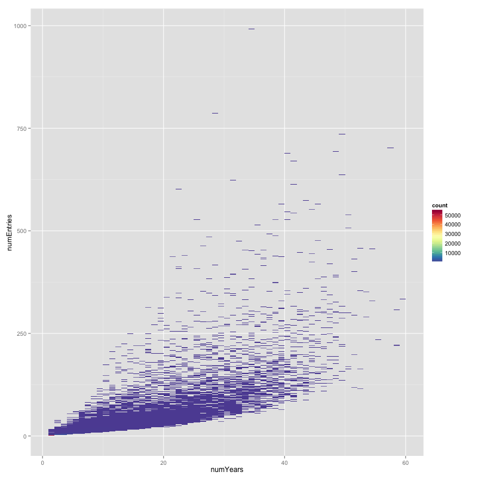
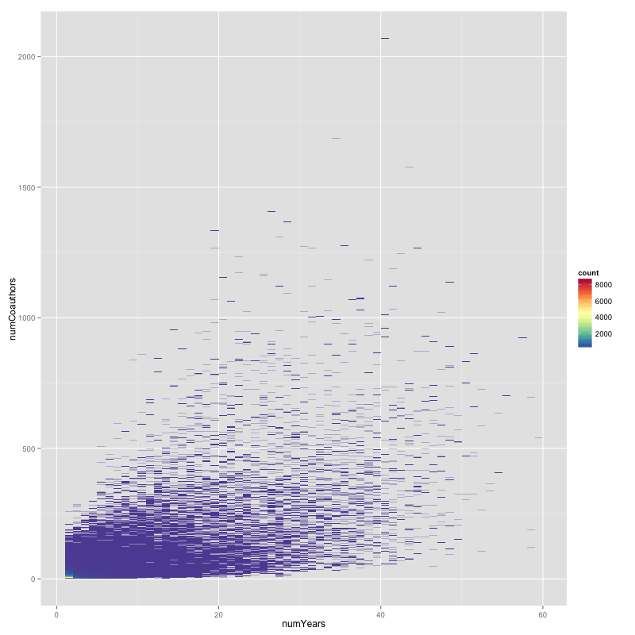
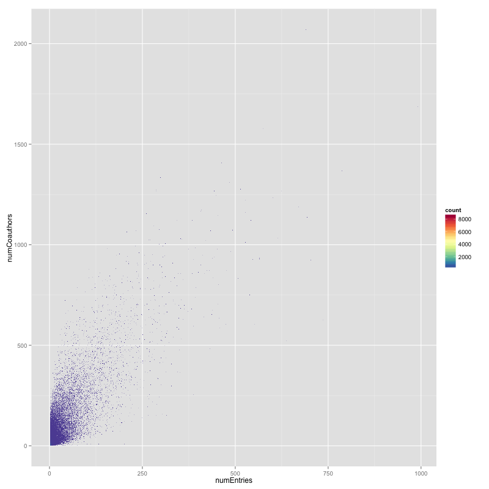

Appendix
========

{#fig:nyne-linear}

{#fig:nync-linear}

{#fig:nenc-linear}

{#fig:complete-graph-1940}

``` {#blk:papersWithoutNAuthors .javascript caption="The mongoshell code to determine the results shown in Table \ref{tbl:papersWithoutNAuthors}" fontsize=\small baselinestretch=1 breaklines=true }
for (i=0; i<=10; i++){
    db.NSR.aggregate([
        {$project: {_id: 1, authors: 1, year: 1}},
        {$unwind: "$authors"},
        {$group: {_id: "$authors", numEntries: {$sum: 1}, papers: {$addToSet: "$_id"}}},
        {$match: {"numEntries": {$gte: i}}},
        {$unwind: "$papers"},
        {$group: {_id: "$papers", uniqueKey: {$sum: {$multiply: [1, 0]}}}},
        {$group: {_id: "$uniqueKey", papersRemaining: {$sum:1}}}
    ], {allowDiskUse: true})
    .forEach(function(myDoc) {
        print( "user: " + myDoc.papersRemaining ); }
    ) }
```

\pagebreak

## prepare-data.py

\inputminted[baselinestretch=1, breaklines=true]{python}{../../data/prepare-data.py}
