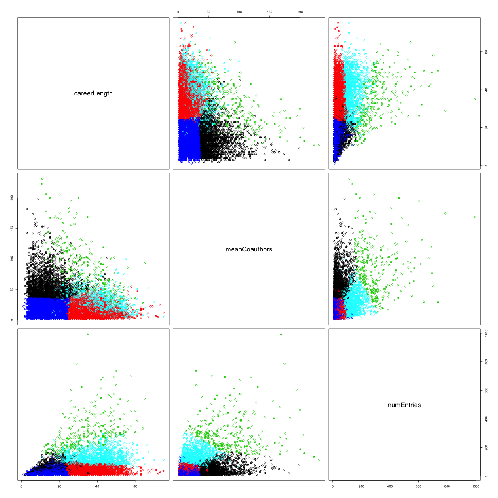
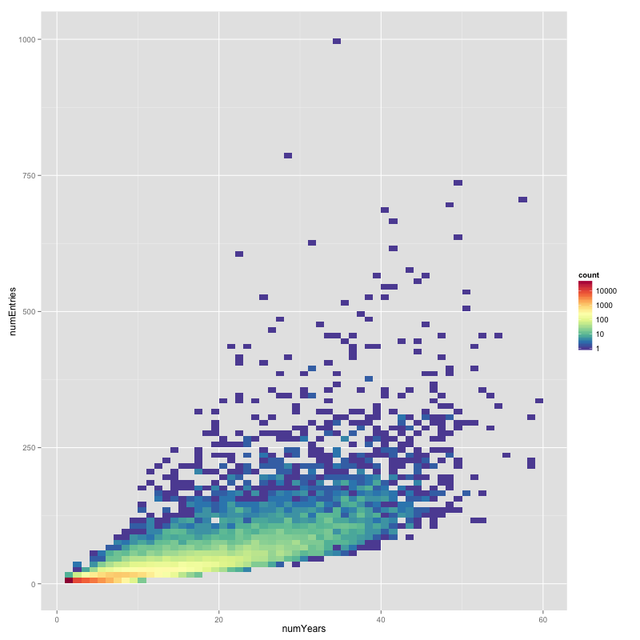

# Data Mining and Exploration of the Nuclear Science References

Andrew Valencik

Masters of Science in Applied Science

December 11th

%- Motivation slide? IR and Vertical search

# NNDC & NSR

[National Nuclear Data Center](http://www.nndc.bnl.gov) (NNDC)

[Nuclear Science References](http://www.nndc.bnl.gov/nsr/) (NSR)

 

# Raw Data

```
<KEYNO   >1988AB01                                                              &
<HISTORY >A19880309 M19880315                                                   &
<CODEN   >JOUR PRVCA 37 401                                                     &
<REFRENCE>Phys.Rev. C37, 401 (1988)                                             &
<AUTHORS >A.Abzouzi, M.S.Antony                                                 &
<TITLE   >Calculation of Energy Levels of {+232}Th,{+232}{+-}{+238}U for K(|p) =&
 0{++} Ground State Bands                                                       &
<KEYWORDS>NUCLEAR STRUCTURE {+232}Th,{+232},{+234},{+236},{+238}U; calculated le&
vels,band features. Semi-empirical formalism.                                   &
<SELECTRS>N:232TH;A. N:232U;A. N:234U;A. N:236U;A. N:238U;A. C:OTHER;A.         &
<DOI     >10.1103/PhysRevC.37.401                                               &
```

# Keyword Abstracts

- `<KEYWORDS>` and `<SELECTRS>`

- Expert produced metadata

- Provides information on the content of the NSR entry

- `NUCLEAR REACTIONS`, `RADIOACTIVITY`, `NUCLEAR STRUCTURE`, `NUCLEAR MOMENTS`, `ATOMIC PHYSICS`, `ATOMIC MASSES`, and `COMPILATION`.


# Selectors

Type, Value, and a Subkey

Types:

> N, T, P, G, R, S, M, D, C, X, A, or Z, which stand for nuclide, target, parent, daughter, reaction, subject, measured, deduced, calculated, other subject, mass range, and charge range, respectively.


%- My app

# NSR Explorer

- Web application (Python, MongoDB, JavaScript, HTML, CSS)
- Offers a (vertical) search interface
- Visualizations for return data
- [NSR Explorer Web App](http://localhost:5000)


# Data Preparation

- Transform raw data to JSON
- Regular expressions
- Repeatable
%- It was long and important work.
%- It laid the foundation for everything else in this thesis.
%- But it is somewhat tedious (dirty work)


# Data Representation...
%- Thesis does rep then features. I'll just show the features and perhaps discuss the rep

Year as an integer...

Authors as an array of strings...


# Data Summarization

First Paper
The discovery of radiation in 1896 by...

```javascript
db.NSR.find({year: 1896})
```
%- Run search in mongo shell
%- Then search '' in app

[NSR Explorer Web App](http://localhost:5000)


# Composition

Type       Amount   Percentage
----       ------   ----------
THESIS     1934     0.908\%
PREPRINT   779      0.366\%
BOOK       107      0.050\%
PC         1661     0.780\%
CONF       16836    7.910\%
REPT       24554    11.53\%
JOUR       165477   77.74\%
UNKNOWN    1487     0.698\%


# Rankings

Author              Number of Publications
------              ----------------------
R.V.F.Janssens                992
M.P.Carpenter                 787
A.Faessler                    736
J.H.Hamilton                  703
I.Ahmad                       694
B.A.Brown                     690
I.Y.Lee                       671


# Contributions

Entry Number Cutoff   Entries Remaining   Difference
-------------------   -----------------   ----------
1                     190654
2                     187741              2913
3                     185404              2337
4                     183410              1994
5                     181315              2095
6                     179606              1709
7                     177945              1661


# Networks

Network graphs with authors as nodes

Copublications are edges or links


# Networks


# Networks

[NSR Explorer Web App](http://localhost:5000)


# Text Mining

- Vector Space Model
- Cosine Similarity


# Similar Papers


# Name Analysis

- Levenshtein Distance
- Transformation


# Data Mining

- Goal: Flexible recommender system
- Need: Underlying structure/patterns


# Association Mining

Frequent pattern mining

- Author Names
- Selectors


# Reactions

rules                              support     confidence   lift
-----                              -------     ----------   ----
{P 290LV,S A-DECAY} => {G 286FL}   0.000298    1.0000       3346.7
{P 289FL,S A-DECAY} => {G 285CN}   0.000310    1.0000       3225.0
{P 29418,S A-DECAY} => {G 290LV}   0.000310    1.0000       3225.0
{P 286FL,S A-DECAY} => {G 282CN}   0.000310    1.0000       3225.0
{G 285CN} => {P 289FL}             0.000310    1.0000       3167.4
{P 289FL} => {G 285CN}             0.000310    0.9821       3167.4


# Clustering




# Publishing

%- Lots of authors publish rarely



