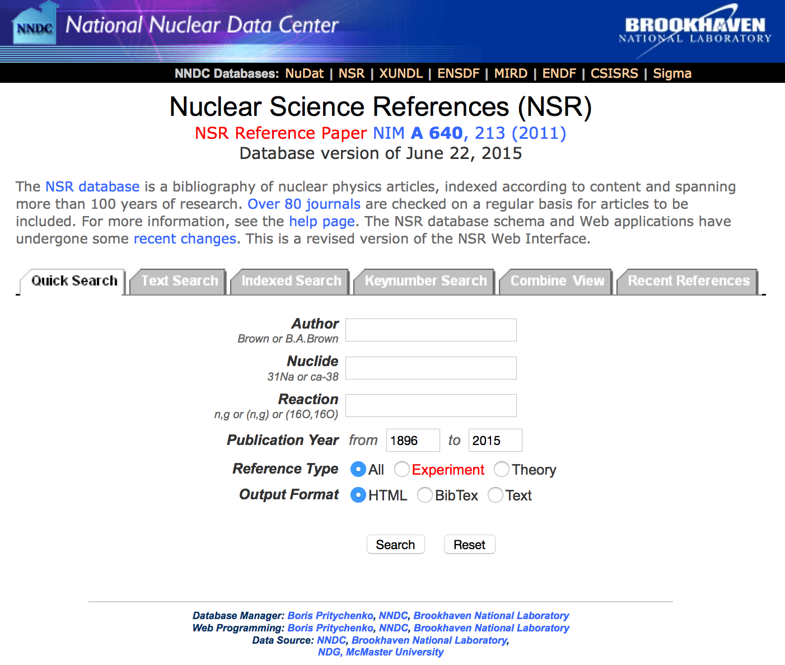
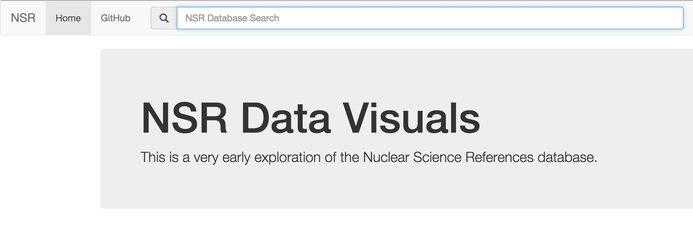
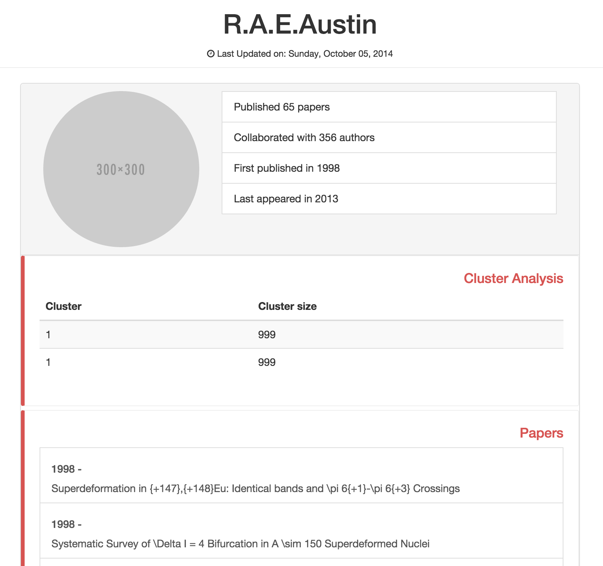
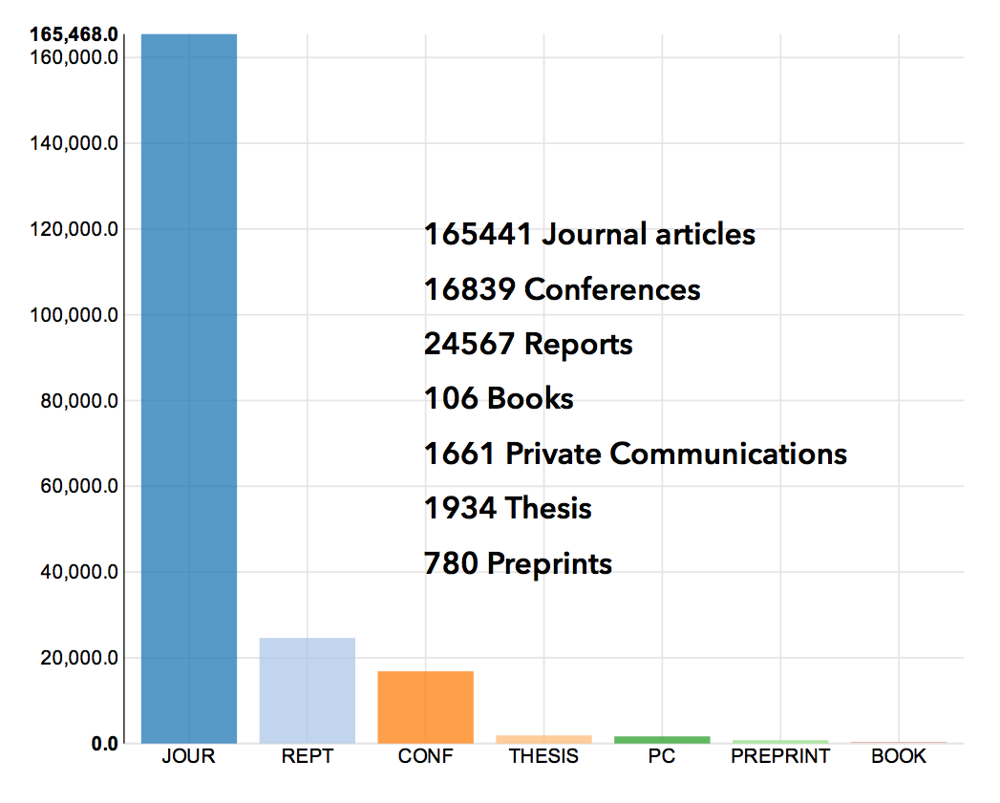
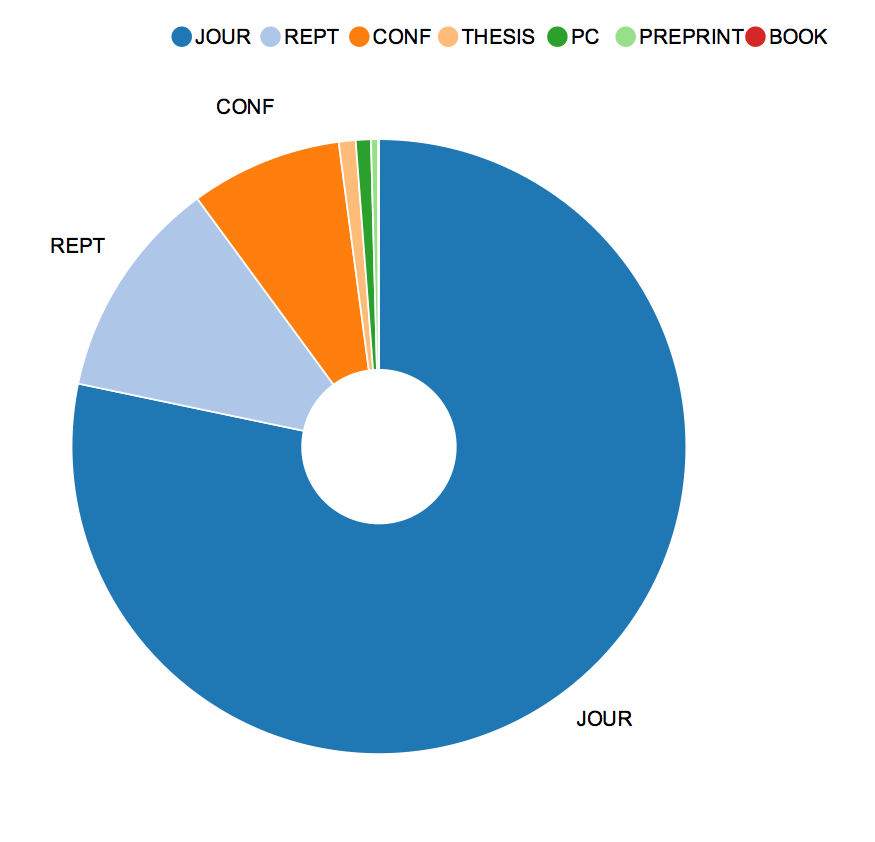
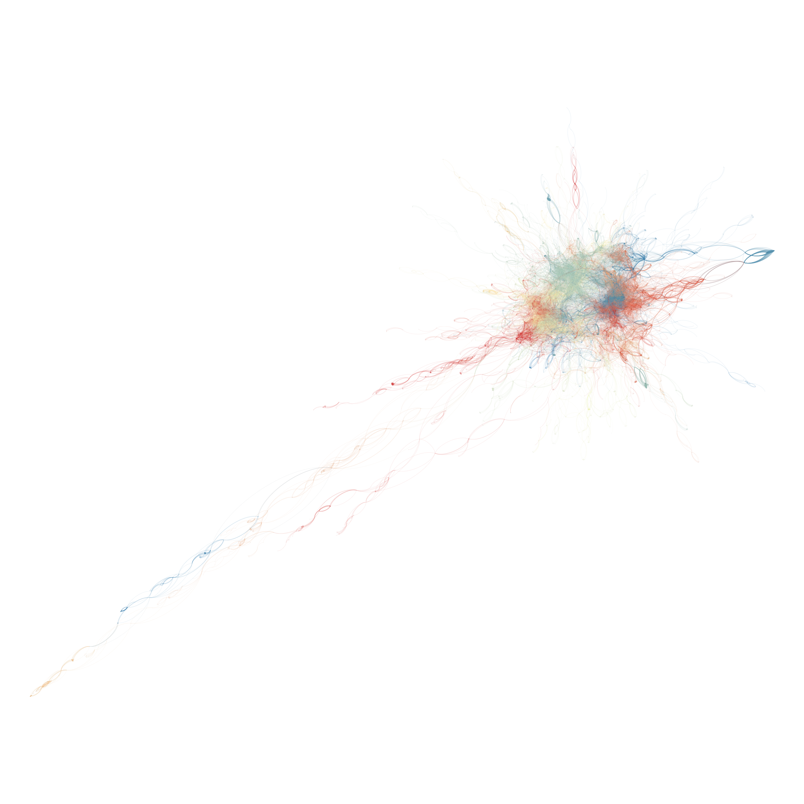
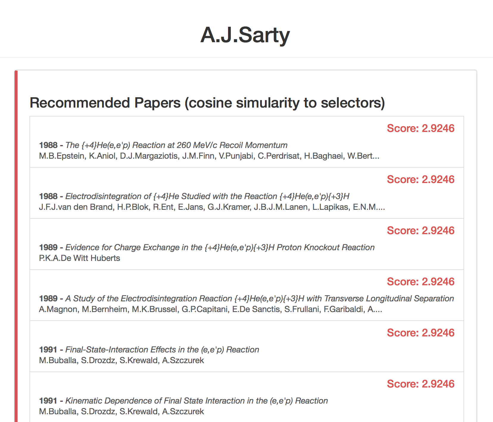

%- TODO balance mentions of application
%- TODO cite: 50 years of kmeans
%- TODO cite: Facebook paper A good overview of the process
%- TODO cite: Medical clusters and MDS paper
---
title:  'Masters of Science in Applied Science Thesis'
author:
- name: Andrew Valencik
  affiliation: Saint Mary\'s University
author: Andrew Valencik
date: October 3rd 2015 - Sorry About That, Saturday Special.
bibliography: bibliography.yaml
csl: american-physics-society.csl
link-citations: true
linestretch: 1.6
...

\listoffigures
\listoflistings
\listoftables


Introduction
============
%- TODO ROBY be less speculative, summarize work

%- The problem and its setting
%- Proposed methodology to solve problem
Information retrieval has been repeatedly improved by large search engines like Google, Yahoo, DuckDuckGo, and more.
Vast quantities of information are now easily retrieved on an extensive array of subjects.
Scientific literature has received special attention through projects like [Google Scholar](https://scholar.google.ca) or [Microsoft Academic Search](http://academic.research.microsoft.com).
However, these projects are still generalized to accommodate all sciences.
Information retrieval and data exploration can be improved by customizing an application to a specific domain.
This work is a cross disciplinary effort, combining semantic information of nuclear physics literature and data mining techniques to build a custom application for data exploration and information retrieval in nuclear science.

The United States [National Nuclear Data Center](http://www.nndc.bnl.gov) prepares an evaluated database of nuclear science literature that poses a rich opportunity for knowledge discovery directed at the scientific work and study.
The knowledge discovery and data mining process reveals trends in the collective scientific study of nuclear structure, processes, and detection.
This data is presented through a web application that extends the existing facilities of the Nuclear Science References web retrieval system.
The ultimate goal is to enable further analysis on the body of nuclear science literature.

%- Define research setting and sum-up what has been done
%- Point towards what should be done, why?
%- What is the problem? What will I study?
%- ROBY good. keep as is.
The academic field of nuclear science is over one hundred years old, starting with the discovery of radiation.
This discovery is the first of many entries in the Nuclear Science References database, collected, cataloged, distributed, and evaluated by the National Nuclear Data Center [@Kurgan200603].
The Nuclear Science References, or NSR, has over 210,000 entries documenting the body of nuclear science literature, which provides the opportunity for knowledge discovery on the literature's meta data.

%- What do we know already?
%- How will this advance our knowledge?
%- Explain your choice of model. Advantages? Suitability from theoretical point of view? practical reasons for using it?
%- Significance, timeliness, and importance of project.

%- Description of the application domain, existing tools, and functional analysis of a comprehensive application that will be helpful to the physicists.
%- Get some screenshots of the NSR website. (automate?)
%- Does the NSR website offer visualizations?
%- Easy method of exporting data?
%- How capable is it as a tool to explore further work?
## The Nuclear Science References Website
The NNDC maintains the [NSR website](http://www.nndc.bnl.gov/nsr/) which serves a simple interface to the Nuclear Science References database.
They offer four primary search interfaces: quick search, text search, indexed search, and keynumber search.
The functionality and architecture of the NSR database and web site is discussed by Pritychenko in @NSRweb.
The quick search interface is shown in Figure @fig:nsrweb1.

 {#fig:nsrweb1}

%- Quick Search
The quick search functionality is the most commonly used interface @NSRweb.
It enables searching by author name, nuclide, or reaction.
Two types of filters are available to limit the results: a year range, and reference type which can return only experimental or theory entries.
Each of the search fields show examples of the type of search as well.
For example the author field shows you can search for an author using their first initials and their last name, or only their last name.

%- Text Search
The text search interface enables text searching in the title, keywords, or both fields.
The search is not case sensitive and requires a search string of at least three characters in length.
Phrases can be used by enclosing them in quotes.
The user can specify a publication year range, or choose a date to filter when the entries were added to the database.
Additionally the user can enable 'primary only' or 'require measured quantity' flags.
The results can be sorted in ascending or descending order and presented in HTML, BibTex, Text, Keynum, or Exchange formats.
The quick search results do not offer these output customizations.

%- Indexed Search
%- Author fingerprinting will improve the author 'browse' button
The interface for indexed searching is similar to the Text Search.
The most important difference is the functionality offered by the browse buttons for the search parameters.
The user can select a parameter of the following types:
Author, FirstAuthor, Nuclide, Target, Parent, Daughter, Subject, Measured, Deduced, Calculated, Reaction, Incident, Outgoing, Journal, Topic, Z(range)
For each of the types available the browser button will redirect to another page that either details the possible values or provides another search through the possible values.
For example, Author and First Author direct to a simple search interface that allows some partial matches against the list of known authors.
%- TODO ROBY have you compared this to your known multiples?

%- Result Analysis
Search queries are remembered and presented in the 'Combine View' tab.
You can combine the results of recent queries with boolean logic.
Analysis is offered on the search queries which displays how many nuclides, authors, journals, and publication years the query involved.

## Proposed Improvements
The primary function of the developed application is increased accessibility to exploration of the Nuclear Science References data.
This includes the authors documented, the papers recorded and keyworded, their links, and all available metadata for the nearly 120 years.
The application makes use of a web interface to aid in increasing accessibility.
All one needs in order to use the application is a modern web browser.
Interactive visualizations are used to encourage exploring the data.
Additionally, the new database structure that is developed in this work enables searches that were previously cumbersome or impossible.

### The Web Application
The web application presents a single search interface as shown in Figure @fig:webapp-search.
This interface can take queries with a specified command, or one can be inferred.
If the user inputs a string that matches an author name than the application retrieves a profile page for that author.
An example profile page for input "R.A.E.Austin" is shown in Figure @fig:author-profile.
The author profiles combine information discussed in Section [Data Summarization](#data-summarization) and Section [Cluster Analysis](#cluster-analysis) .

If the user inputs a year or year range such as `1989` or `1970-1979` than a summary of the data for those years is shown.
This summary uses information and visualizations discussed in Section [Data Summarization](#data-summarization).

 {#fig:webapp-search}

 {#fig:author-profile}

Visualizations of a network of collaborators are retrieved with the `collab:` command.
For example, `collab:R.A.E.Austin` will retrieve a network graph of all the authors who have published with `R.A.E.Austin`.
Additionally, the `collab:` command can take a nuclide as an input and generate a network graph of all authors who have published on that nuclide.
Analysis of the network graphs is further discussed in Section [Network Analysis and Visualization](#network-analysis-and-visualization).

The `simpapers:` command returns a list of papers that are considered similar to the input selection.
The command can take an authors name, or NSR Keynumber as valid inputs.
An example for author "A.J.Sarty" is shown in Figure @fig:simpapers-author.
The method by which papers are determined to be similar is discussed in Section [Cosine Similarity of NSR Selectors](#cosine-similarity-of-nsr-selectors).


The Data and Database
=====================
%- Data Structure and Representation?
The United States National Nuclear Data Center (NNDC) has composed the Nuclear Science References (NSR) database.
A full database dump of the NSR was acquired on January 29th 2014.
For simplicity, the data acquired from the NNDC on that date will be referred to as if it were the complete NSR database.
All efforts have been taken to ensure the research procedures can easily be extended and repeated on new NSR data.

## Data Preparation
The NSR data is maintained in a custom EXCHANGE format @winchell2007nuclear.
This format is flat text that is not suitable for direct analysis.
To fully utilize the data, it needs to be easily parsed into a data structure for analysis and use.
The approach least likely to introduce errors is to transform the data into a common format for which parsers already exist.

[JavaScript Object Notation](http://json.org), or JSON, was chosen as the data format for this work.
While other data formats could have sufficed (perhaps [YAML](http://yaml.org), for example), certain common data formats like comma separated values (csv) would have been more difficult.
JSON met the requirements, including those for arrays and has the advantage of being openly available, well-supported, with a handy user community, and it was familiar to the author.
This requirement is discussed further in the [Data Representation](#data-representation) section.

%- NSR EXCHANGE format discussion
An example of the raw data for a single paper can be seen in Snippet \ref{blk:rawNSRentry}.
The NSR has 9 possible types of fields which are shown in Table @tbl:NSRidentifiers.
Each entry can only have one of each field type except for `<KEYWORDS>` and `<SELECTRS>` which exist as a pair and an entry can have multiple pairs of them.

``` {#blk:rawNSRentry .text caption="An example NSR entry showing the raw NSR data format." fontsize=\small baselinestretch=1}
<KEYNO   >1988AB01                                                              &
<HISTORY >A19880309 M19880315                                                   &
<CODEN   >JOUR PRVCA 37 401                                                     &
<REFRENCE>Phys.Rev. C37, 401 (1988)                                             &
<AUTHORS >A.Abzouzi, M.S.Antony                                                 &
<TITLE   >Calculation of Energy Levels of {+232}Th,{+232}{+-}{+238}U for K(|p) =&
 0{++} Ground State Bands                                                       &
<KEYWORDS>NUCLEAR STRUCTURE {+232}Th,{+232},{+234},{+236},{+238}U; calculated le&
vels,band features. Semi-empirical formalism.                                   &
<SELECTRS>N:232TH;A. N:232U;A. N:234U;A. N:236U;A. N:238U;A. C:OTHER;A.         &
<DOI     >10.1103/PhysRevC.37.401                                               &
```

Identifiers   Description
-----------   -----------
`<KEYNO   >`  Reference keynumber
`<HISTORY >`  Administrative record
`<CODEN   >`  Standard form reference
`<REFRENCE>`  Free text reference
`<AUTHORS >`  Author names
`<TITLE   >`  Reference title
`<KEYWORDS>`  Keyword abstract
`<SELECTRS>`  Indexing parameter list
`<DOI     >`  Digital object identifier

Table: The nine legal record identifiers from the Nuclear Science References Coding Manual @winchell2007nuclear. {#tbl:NSRidentifiers}

The `<KEYNO   >` field is a unique key number assigned to each NSR entry.
The data on which a particular entry was added to the database or last modified is encoded in the `<HISTORY >` field.
The `<CODEN   >` and `<REFRENCE>` fields contain information about the journal or other type of resource the document came from.
The `<AUTHORS >` field is a comma separated list of author names.
The author list is one of the key relational components of the data, establishing links between papers and other authors.
The `<TITLE   >` field is a free text field representing the title of the reference with a custom set of abbreviations for special characters like Greek letters.
These abbreviations are detailed in the NSR coding manual @winchell2007nuclear.
In this work, the abbreviations have been translated to \LaTeX.
The `<DOI     >` field contains the digital object identifier code that uniquely links to the source document's metadata.
While not strictly necessary, the DOI often has a URL associated with it that links to the source document on the website of the publishing journal @wiki-DOI.
The two fields, `<KEYWORDS>` and `<SELECTRS>` have the most structure and require special attention which is given in Section [Keyword Abstracts](#keyword-abstracts).

%- NSR to JSON
Transforming the NSR data to JSON is possible with a series of search and replace commands using regular expressions.
The commands are recorded in the Perl[^why-perl] script `parseNSRtoJSON.pl` available at [github.com/valencik/mastersAPSC](https://github.com/valencik/mastersAPSC).
The result of the scripts is a file with a valid JSON structure for each NSR entry.

[^why-perl]: Perl is used here as it remains one of the best RegEx implementations, and allowed for scripts that read as a simple ordered list of transformations to apply.

The data representation is the result of careful consideration of the types of queries to be made on the data.
The data schema uses data types that best reflect how the data will be used.
For example, with data spanning 120 years, it is helpful to filter the data based on a numeric year value.
As such the `year` value in the data schema is an integer.
Allowing the construction of a simple query to get all the entries from a given year range.
Example code to retrieve all NSR entries from the 1970's is given in Snippet \ref{blk:NSR1970s}.

``` {#blk:NSR1970s .python caption="Python code to get all NSR entries from 1970 to 1979." fontsize=\small baselinestretch=1}
import pymongo
db = pymongo.MongoClient()['masters']
db.NSR.find({"year": {"$gte": 1970, "$lt": 1980}})
```

%- Author data structure
The list of authors for a NSR entry is a more complicated data type as it involves multiple elements.
It is best represented as an array of strings, with each unique author being a separate string element in the array.
The representation of the author list as an array instead of a free text field is beneficial as the author list is now a data structure.
With this structure comes information and ease of computing different properties of that data.
The length of the array tells us how many authors collaborated on a given NSR entry.
And since arrays are ordered, we can easily determine the first author[^first-author] of an entry.
While it is possible to extract the same information from a free text field, parsing our data into data structures creates structures that are compatible with many tools, such as our database.
Users of the database can now sort entries by their number of authors, or count the number of times someone was first author on an entry.
Additionally, almost every aggregation query[^see-aggregation] made in this work relies on unwinding a data array at some stage.

[^first-author]: The significance, if any, of being first author changes amongst journals. A clever data scientist would want to consider the `<REFRENCE>` information along with any first author analysis.
[^see-aggregation]: See the [MongoDB Aggregation Framework](#mongodb-aggregation-framework) section for more details.

%- Getting into SQL vs NoSQL here...
It is possible to store the NSR data in a relational model.
However, it is more efficient to convert the original data into a data schema that uses arrays.
This is the primary motivator for not using a standard relational database.
In a relational database the authors would have their own tables, separate from papers, as they are separate entities.
This inefficient choice would entail a table and data schema created for the papers and then a separate table and schema for the authors, and similarly for keywords, selectors, and history.

### Keyword Abstracts
%- TODO complete this discussion
%- TODO include the fact that a human reads each entry and creates keywords
The `<KEYWORDS>` field is written by the maintainers of the NSR database, and then used to generate the `<SELECTRS>` field.

> "What distinguishes NSR from more general bibliographic databases is the level of detail provided in the keyword abstracts." @winchell2007nuclear

The selectors are generated from the keyword abstracts.
The current schema has `<SELECTRS>` parsed into a 3 dimensional array with `type`, `value`, and `subkey` variables.
The following quote from the NSR Coding Manual @winchell2007nuclear describes the valid `type`s:

> N, T, P, G, R, S, M, D, C, X, A, or Z, which stand for nuclide, target, parent, daughter, reaction, subject, measured, deduced, calculated, other subject, mass range, and charge range, respectively. @winchell2007nuclear

The type of data for `value` changes based on the value of the `type`.
For `type`s N, T, P, and G, the `value` is a nuclide written in the form AX with A equal to the mass number, and X equal to the chemical symbol.
The value for A may have any number of digits.
X may be one, two, or three letters.
The `subkey` variable is used to link together multiple selectors of the same keyword sentence.

## Final Representation
An example of the final data representation used by the work is shown in Snippet \ref{blk:rawNSRJSON}.
The `_id` is used as the unique identifier in the MongoDB collection.
The `year` is an integer and represents the year the resource was published.
The `history` is an array that contains encoded information representing dates when the original NSR document was added and/or modified.
The `code` is a copy of `CODEN` from the NSR data.
The `type` describes what publication type (journal, thesis, conference paper, etc) the resource is.
The `reference` is a copy of `REFRENCE` from the NSR data.
The `authors` is an array of string elements representing the authors who published that resource.
The `title` is a string, formatted for \LaTeX, that represents the title of the resource.
The `keywords` is an array of strings that represent the KEYWORD sentences as described in the NSR manual.
The `selectors` is an array of objects that contain the type, value, and subkey information generated by the keyword entry by the NSR.
The `simPapers` array contains objects, where each object refers to another NSR entry that is above a minimum similarity threshold.
It is a calculated field and is further discussed in Section [Cosine Similarity of NSR Selectors](#cosine-similarity-of-nsr-selectors).
Finally, the `DOI` is a Digital Object Identifier for the published resource.

``` {#blk:rawNSRJSON .json caption="An example NSR entry showing the final NSR JSON structure." fontsize=\footnotesize breaklines=true baselinestretch=1}
{
  "_id": "1988AB01",
  "year": 1988,
  "history": [ "A19880309", "M19880315" ],
  "code": "JOUR PRVCA 37 401",
  "type": "JOUR",
  "reference": "Phys.Rev. C37, 401 (1988)",
  "authors": [ "A.Abzouzi", "M.S.Antony" ],
  "title": "Calculation of Energy Levels of {+232}Th,{+232}{+-}{+238}U for K(\\pi ) = 0{++} Ground State Bands",
  "keywords": [ "NUCLEAR STRUCTURE {+232}Th,{+232},{+234},{+236},{+238}U; calculated levels,band features. Semi-empirical formalism." ],
  "selectors": [
    { "type": "N", "value": "232TH", "subkey": "A" },
    { "value": "232U", "subkey": "A", "type": "N" },
    { "type": "N", "value": "234U", "subkey": "A" },
    { "subkey": "A", "type": "N", "value": "236U" },
    { "type": "N", "value": "238U", "subkey": "A" },
    { "type": "C", "value": "OTHER", "subkey": "A" }
  ],
  "DOI": "10.1103\/PhysRevC.37.401",
  "simPapers": [
    { "score": 0.90890002250671, "paper": "1992BAZJ" },
    { "score": 0.89768290519714, "paper": "1994CH14" },
    { "score": 0.88365876674652, "paper": "1979FAZX" },
    { "score": 0.81536161899567, "paper": "1983DU10" },
    { "score": 0.8083301782608, "paper": "1979CH02" },
    { "score": 0.7871305346489, "paper": "1984PE01" },
    { "score": 0.76397824287415, "paper": "1960DU10" },
    { "score": 0.76397824287415, "paper": "1981SE07" },
    { "score": 0.76397824287415, "paper": "1995KU31" },
    { "score": 0.76397824287415, "paper": "1999BU03" },
    { "score": 0.76397824287415, "paper": "2011NA24" },
    { "score": 0.76335608959198, "paper": "1985ZH08" },
    { "score": 0.74211376905441, "paper": "1975IVZM" },
    { "score": 0.73295497894287, "paper": "1981MA35" },
    { "score": 0.73295497894287, "paper": "1996ZH29" },
    { "score": 0.72842478752136, "paper": "1979ES06" },
    { "score": 0.72127419710159, "paper": "1982MI12" },
    { "score": 0.72127419710159, "paper": "1983MI19" },
    { "score": 0.70403093099594, "paper": "1973IM02" }
  ]
}
```

## The Database - MongoDB

[MongoDB](https://www.mongodb.org) is an open source NoSQL document store database system.
It was chosen because it is open source, easy to use, well supported, and the author is familiar with it.
Additionally it has nice features such as JSON support, an aggregation framework, and is easy to setup.
Other NoSQL databases like CouchDB support JSON and may have been acceptable as well.
MongoDB and CouchDB are both comparatively new database systems.
Postgres also supports JSON and is a mature database system.
Despite the prevalence of MySQL, it was not chosen because it is a relational database and would thus not support the arrays in the data schema as outlined in Section [Data Preparation](#data-preparation).

A document store database such as MongoDB enables simple transformations of each NSR entry into a Mongo document (as discussed in [Data Preparation](#data-preparation)).
In a relational database system such as MySQL, each NSR entry would have to be split up, with different pieces of information populating different database tables.
Authors would be a type of entity in their own authors table, that each NSR entry in an NSR table would link to.
This type of relationship would be necessary for keywords and selectors as well.

As reported in Section [Data Representation](#data-representation), a JSON structure was constructed for each entry in the NSR database.
To populate the MongoDB database, these JSON structures were flattened into a single file, and imported into a MongoDB collection using the [`mongoimport` tool](http://docs.mongodb.org/manual/reference/program/mongoimport/).

### Indexing the Data
The performance of the database can be optimized by indexing on important or frequently referenced fields such as "authors" and "year".
Indexing speeds up search queries in a manner similar to sorting a series of data elements.
MongoDB allows for many different types of indexes.
We create a single field indexes on the `_id`, `year`, `authors`, `selectors.type`, `selectors.value`, and `type` fields[^dot-notation].
This enables fast lookups for documents[^documents] according to the indexed fields.
For example it would be quick to find all the documents with type 'Journal' and year '1983'.
Text indexes can also be created to enable fast search of words in the titles or keyword fields.
This has not been done as the titles and keyword fields are not used in our analysis.
We instead make use of the list of selectors to infer the topic of a given NSR entry.

[^dot-notation]: We use dot notation to denote that `selectors.type` refers to the `type` field of the `selectors` object.
[^documents]: Recall that MongoDB is a 'document' store database, and each NSR entry has been imported as a 'document' in the MongoDB collection.

%- Other concerns and code
There are additional concerns in hosting a database server and web application.
Typically a database is hosted on a dedicated server, separate from the web application, and perhaps not publicly facing.
These issues, and additional performance configurations will not be further addressed in this work.
They are however addressed in the code repository for this work available at: [github.com/valencik/mastersAPSC](https://github.com/valencik/mastersAPSC).

### MongoDB Aggregation Framework
The MongoDB Aggregation Framework is powerful and enables a lot of data manipulation.
There are a handful of simple aggregation operations that can be piped together to build complex queries.
All aggregation operations take in a list of data documents, manipulate them in some way, and then output the results to the next operation.

The `match` operation acts as a filter, returning only the documents that meet the specified criteria.
The `project` operation manipulates each individual document renaming, omitting, or changing each field according to the input parameters.
The `unwind` operation acts on an array field of the input documents.
It creates a new document for each element in the array, with all fields duplicated exist the array field which is equal to the element.
The `group` operation can combine similar documents and can perform calculations based on that combination.
A common usage is to sum a value, perhaps price, of all the input documents.

There are some additional, more straightforward, operations such as `sort`, `limit`, `skip`, and `redact`.
The final results from an aggregation query can be saved to a collection using the `out` operation, or can be returned to the calling application through the many MongoDB APIs.

%- Documentation links
MongoDB is currently a popular database and there exist tutorials and example applications.
The MongoDB documentation is well written and provides a good overview of the aggregation framework @mongo-doc.
All MongoDB interactions in this work use the python driver, `pymongo` @pymongo-doc.

### Future Work
An extension to this work is to support additional database systems.
The prevalence of MySQL is motivation to support it.
However, in continuing with the desire to use a NoSQL database system, the work could be extended to support CouchDB with relative ease.


Data Summarization
==================
%- What? Created summaries and ranked info in a web app.
%- Why? Visualizations are important in understanding data. As are summaries and rankings.
%- How? MongoDB aggregations to D3 charts.

## Data Composition and Queries
Through data summarization we can learn the first-order characteristics of the data set.
Our goal was to obtain a broad perspective of its structure and composition.
For example, there are 212835 entries[^our-data-set] that span from 1896 to 2014.
We can answer questions such as "What percentage of all entries are journal articles?"
As Table @tbl:typesAll shows, the majority of the document types in the NSR are journal articles.
The next most popular are reports, and conference proceedings.
There are fewer books and preprints than there are unknown and unlabeled entries.
The python code to produce these results is shown in Snippet \ref{blk:typesAllCode}.

[^our-data-set]: Recall that the data set used in this work is a snapshot of the entire NSR data as downloaded in January 2014.

Type       Amount   Percentage
----       ------   ----------
THESIS     1934     0.908\%
PREPRINT   779      0.366\%
BOOK       107      0.050\%
PC         1661     0.780\%
CONF       16836    7.910\%
REPT       24554    11.53\%
JOUR       165477   77.74\%
UNKNOWN    1487     0.698\%

Table: The amounts of each type of NSR entry in the whole data set. {#tbl:typesAll}

``` {#blk:typesAllCode .python caption="The aggregation query to get amount of types in the NSR." fontsize=\small baselinestretch=1}
import pymongo
db = pymongo.MongoClient()['masters']
db.NSR.aggregate([{"$group": {"_id": "$type", "count": {"$sum": 1}}}])
```

%- Slice of author
The summarization analysis can conveniently be applied to subsets of the data.
The data can be filtered to only involve a particular author.
This provides answers to questions such as "what percentage of A.J.Sarty's contributions were journal articles?"
Table @tbl:typesAJSarty shows A.J.Sarty has primarily worked on journal articles, with one preprint article.
The code for this query, which is shown in Snippet \ref{blk:typesAJSarty}, simply adds a `$match` operation to Snippet \ref{blk:typesAllCode}.

Type       Amount   Percentage
----       ------   ------
PREPRINT   1        5\%
JOUR       21       95\%

Table: Different types of NSR entries for author A.J.Sarty. {#tbl:typesAJSarty}

``` {#blk:typesAJSarty .python caption="Aggregation query to get the types of an author's publications." fontsize=\small baselinestretch=1}
import pymongo
db = pymongo.MongoClient()['masters']
db.NSR.aggregate([{"$match": {"authors": "A.J.Sarty"}},
                  {"$group": {"_id": "$type", "count": {"$sum": 1}}}])
```

%- Slice of time
The data can also be partitioned or sliced in time, supporting questions such as "what percentage of 1989 entries are journal articles?"
As we can see from Table @tbl:types1989 $72.06\%$ of the NSR entries in 1989 are journal articles.
This percentage is different than that of the whole work (as shown in Table @tbl:typesAll), but not by a significant amount.
It does highlight a particular point of interest, i.e. that the data is not uniform.

Type       Amount   Percentage
----       ------   ----------
THESIS     16       0.398\%
PREPRINT   21       0.523\%
BOOK       7        0.174\%
PC         14       0.348\%
CONF       331      8.248\%
REPT       732      18.24\%
JOUR       2892     72.06\%

Table: Different types of NSR entries in 1989. {#tbl:types1989}

%- Rankings
For a particular selection of NSR data, it is useful to know the rankings for important data fields.
For example, when a user searches an author on the application they are presented with a ranked list of their most frequent coauthors, keywords, and nuclides.
This type of analysis can of course be applied to the whole dataset as well.
Table @tbl:prolific-authors shows the authors with the highest count of NSR entries in the entire database.

Author              Number of Publications
------              ----------------------
R.V.F.Janssens                992
M.P.Carpenter                 787
A.Faessler                    736
J.H.Hamilton                  703
I.Ahmad                       694
B.A.Brown                     690
I.Y.Lee                       671
W.Greiner                     637
A.O.Macchiavelli              624
T.L.Khoo                      614

Table: The top 10 most prolific authors in the NSR database. {#tbl:prolific-authors}
%- TODO perhaps reduce to 5 to avoid page splitting

## Visualizations

Visualizations provide a summary of data at a glance.
Consider Figure @fig:nsrhisto, which quickly demonstrates that the majority of NSR entries were published in the last 50 years.

{#fig:nsrhisto}

The low publication numbers in the first 50 years was a useful property of the dataset.
It permitted testing data analysis code on small portions of the data (years pre 1950), before applying the code to the full dataset.
This was helpful in developing the network analysis code and visualizations, as post 1950 the networks are too large to process quickly.

There are two primary visual methods for displaying summary information in this application: histograms and pie charts.
The histograms, as seen in Figure @fig:nsrhisto, can show how a slice of the database evolves over time.
It is also useful to see amounts in categorical data.
Figure @fig:viz-types-histo shows the amount of each different document type in the NSR database.

{#fig:viz-types-histo}

The pie charts demonstrate the relative sizes of portions of the data.
The docuent type amounts are shown in Figure @fig:viz-types-pie as a pie chart.
Figures @fig:viz-types-histo and @fig:viz-types-pie are visual representations of the data in Table @tbl:typesAll.

{#fig:viz-types-pie}


Network Analysis and Visualization
==================================
%- What? Enabled graph data structure operations on NSR author data.
%- Why? This is not possible with existing NSR data... Why useful?
%- How? Using python library Networkx to build graph datastructures. D3 and Gephi for visualizations
All previous analysis of the NSR data has focused on the content of each entry in a flat manner.
However, the list of authors of a paper can be used to build a network or graph of the authors.
In this work, the word 'graph' will always refer to the mathematical representation of a set of objects and their links.

##Data Graphs
The first graphs constructed in this work had each node represent an author, and each edge or link represent a coauthorship.
An example can be seen in Figure @fig:small-graph-1940.

{#fig:small-graph-1940}

Figure @fig:small-graph-1940  is a single component of the complete 1940 author graph (shown in Appendix Figure @fig:complete-graph-1940).
It has 7 nodes, each of which is a different author, and 12 edges, which represent a coauthorship between the two nodes.
`M.Ikawa` has published with everyone in the graph.
We can use this knowledge in a database query to get the papers that make up this graph (see Snippet \ref{blk:graph1940s}).

``` {#blk:graph1940s .python caption="Python code to get the NSR entries in Figure \ref{fig:small-graph-1940}." fontsize=\small baselinestretch=1}
import pymongo
db = pymongo.MongoClient()['masters']
db.NSR.find({"year": 1940, "authors": "M.Ikawa"})
```

The results of the database query (shown in Snippet \ref{blk:graph1940s-results}) reveal there were 3 papers in 1940 that contributed to this graph.
One paper titled "Fission Products of Uranium by Fast Neutrons" has authors `Y.Nishina`, `T.Yasaki`, `K.Kimura`, and `M.Ikawa`.
The other papers, titled "Neutron Induced Radioactivity in Columbium" and "Artificial Radioactivity Induced in Zr and Mo" respectively are both authored by `R.Sagane`, `S.Kojima`, `G.Miyamoto`, and `M.Ikawa`.
This demonstrates a limitation in the current graph visualization.
`G.Miyamoto` and `M.Ikawa` have published together twice (in 1940) but their edge looks no different than the edge between `Y.Nishina` and `T.Yasski`.
Most graph libraries allow for a lot of customization and embedding of data.
In a future work, the graphing routines could be modified to represent the number of copublications along the graph edges.
This could be achieved with a text label, or an added thickness to the edge line.

``` {#blk:graph1940s-results .json caption="JSON documents for the NSR entries in Figure \ref{fig:small-graph-1940}." fontsize=\footnotesize breaklines=true baselinestretch=1}
{
  "_id": "1940NI03",
  "year": 1940,
  "history": [
    "A19800701",
    "M19860317"
  ],
  "code": "JOUR PHRVA 58 660",
  "type": "JOUR",
  "reference": "Phys.Rev. 58, 660 (1940)",
  "authors": [
    "Y.Nishina",
    "T.Yasaki",
    "K.Kimura",
    "M.Ikawa"
  ],
  "title": "Fission Products of Uranium by Fast Neutrons",
  "DOI": "10.1103\/PhysRev.58.660"
}
{
  "_id": "1940SA06",
  "year": 1940,
  "history": [
    "A19800701",
    "M20010110"
  ],
  "code": "JOUR PPMJA 22 174",
  "type": "JOUR",
  "reference": "Proc.Phys.-Math.Soc.Japan 22, 174 (1940)",
  "authors": [
    "R.Sagane",
    "S.Kojima",
    "G.Miyamoto",
    "M.Ikawa"
  ],
  "title": "Neutron Induced Radioactivity in Columbium"
}
{
  "_id": "1940SA08",
  "year": 1940,
  "history": [
    "A19800701",
    "M19980402"
  ],
  "code": "JOUR PHRVA 57 1179",
  "type": "JOUR",
  "reference": "Phys.Rev. 57, 1179 (1940)",
  "authors": [
    "R.Sagane",
    "S.Kojima",
    "G.Miyamoto",
    "M.Ikawa"
  ],
  "title": "Artificial Radioactivity Induced in Zr and Mo",
  "DOI": "10.1103\/PhysRev.57.1179"
}
```

%- Multiple components
We can also visualize graphs with multiple components.
Disconnected components, like those visible in Figure @fig:first50years, are groups of authors who have published together and not with any author in another component.
There is only ever one node per author identifier.
Most graphs produced from yearly data queries have multiple components.
As the data slice forming the graph gets larger the main connected component gets much larger than the rest of the components.
%- I did some analysis on this for the whole dataset

{#fig:first50years}

%- Large graphs
The visualization of large graphs is computationally intensive and produces complex images.
All the graphs produced in the web application are done so using a modified version of [Mike Bostock's Force Directed Graph](http://bl.ocks.org/mbostock/4062045).

%- Size
Above a certain size, these images are of questionable usefulness.
The resulting shape or 'layout' of a graph is dependent on the graph layout algorithm used.
Figures @fig:nsr1989graphyifanhu and @fig:nsr1989graph use the same input data and two different layout algorithms (Yifan Hu ML and Atlas 2 respectively).
The position of the nodes and edges in these figures are products of the layout algorithm used.
The two figures are visually different enough to suggest that their positional information is meaningless.

The colour of the nodes is determined by Gephi's modularity function @gephiModularityAlgorithm.
The modularity of a graph is a measure of structure.
The graph is partitioned into communities where there are dense intra-community connections and sparse inter-community connections.

{#fig:nsr1989graphyifanhu}

{#fig:nsr1989graph}

## Nuclide Graphs
Almost any parameter can be used as a filter to produce an author network graph.
The selector values present an interesting opportunity in this case.
We can filter the NSR data to only include entries that involved a particular nuclide.
Figure @fig:li11graph shows an author node graph for all the NSR entries that have `LI11` as a selector value.
The figure shows that there is one large connected component of the graph, and many smaller components.
Just the largest connected component can be viewed by adding `topnetwork:1` to the input query.

{#fig:li11graph}

## Implementation
%- Citation
The Python library [Networkx](https://networkx.github.io) was used to create the graph data structures, which can then be sent to our visualization code, or be exported for analysis with other tools.
Networkx has a collection of algorithms and functions used to analyze and manipulate the graphs.
Such manipulations include identifying and sorting disconnected subgraphs within a slice of data.
For example, Figure @fig:nsr1989graphyifanhu and Figure @fig:nsr1989graph use only the largest connected graph of all the NSR entries in the year 1989.

## Exporting Graph Data
%- TODO ROBY say something about typical social network?
Treating the NSR database as graph data opens up avenues for future work.
All of the graphs we have created have authors as nodes with edges determined by their coauthors.
These graphs are social networks of collaborating scientists.
The study of them could be of interest to social scientists and network scientists.

Exporting the graph data helps enable future work.
The Networkx library has support for writing the graph data structures to multiple file types, such as `gexf`, `GML`, `GraphML` and [others](http://networkx.readthedocs.org/en/latest/reference/readwrite.html).
These files can then be imported into other analysis applications like Gephi.
Example code for exporting the 1989 data to `gexf` format is available at [github.com/valencik/mastersAPSC](https://github.com/valencik/mastersAPSC).


Text Mining
===========
%- TODO citation
Text mining is an area of analysis that focuses on extracting useful information from unstructured plain text data.
The data to analyze is often natural language text written by humans.
Examples of such data include user reviews of a product or service, customer feedback comments, emails, forum posts, or even academic journal articles.

A simple goal of text mining could be to summarize the input text.
However, this can be abstracted further to 'numericizing' text data for use in an analysis model.

## Cosine Similarity
%- https://stackoverflow.com/questions/15173225/how-to-calculate-cosine-similarity-given-2-sentence-strings-python
In order to compare two items we need a metric by which we can measure them.
In the Section [K-means Clustering](#k-means-clustering) we discuss distance metrics for clustering.
When dealing with text we often use the cosine similarity of two documents to compute their distance.
We build a term vector for each document to be analyzed, this is a vector describing the amount of occurrences each word has in the document.
Let document one, $d1$, be "The quick brown fox jumped over the lazy dog" and document two, $d2$, be "The brown dog jumped over the brown fox".
We create a term vector for each document, as seen in table @tbl:termtable.
Often in doing this, common words like "the" are omitted.
Equations @eq:d1termvector and @eq:d2termvector are the term vectors for each document.
The cosine similarity is the dot product of the two documents divided by the product of their magnitudes @eq:cosinesimilarity. @huang2008similarity

vector    quick   brown   fox   jumped   over   lazy   dog
------    -----   -----   ---   ------   ----   ----   ---
d1        1       1       1     1        1      1      1
d2        0       2       1     1        1      0      1

Table: Term vectors for $d1$ and $d2$. {#tbl:termtable}

$$
d1 = \left< 1, 1, 1, 1, 1, 1, 1 \right>
$$ {#eq:d1termvector}

$$
d2 = \left< 0, 2, 1, 1, 1, 0, 1 \right>
$$ {#eq:d2termvector}

$$
\cos (d1,d1) = \frac{d1 \cdot d2 }{\left| d1 \right| \left| d2 \right|}
$$ {#eq:cosinesimilarity}

$$
 d1 \cdot d2 = (1)(0) + (1)(2) + (1)(1) + (1)(1) + (1)(1) + (1)(0) + (1)(1) = 6.0
$$ {#eq:cosinesimilarity1}

$$
 \left| d1 \right| = \left( (1)^2 + (1)^2 + (1)^2 + (1)^2 + (1)^2 + (1)^2 + (1)^2 \right) ^{\frac{1}{2}} =  2.645751311
$$ {#eq:cosinesimilarity2}

$$
 \left| d2 \right| = \left( (0)^2 + (2)^2 + (1)^2 + (1)^2 + (1)^2 + (0)^2 + (1)^2 \right) ^{\frac{1}{2}} =  2.828427125
$$ {#eq:cosinesimilarity3}

$$
\cos (d1,d2) = \frac{d1 \cdot d2 }{\left| d1 \right| \left| d2 \right|} = \frac{6.0}{\left| 2.645751311 \right| \left| 2.828427125 \right|} = 0.8017837257
$$ {#eq:cosinesimilarityF}

As Equation @eq:cosinesimilarityF shows, the two documents are quite similar, and thus have a high cosine similarity.
When $d1 = d2$ the similarity is 1.0.
This technique is a simple way of numercizing text for further mathematical manipulation and treatment.

### Cosine Similarity of NSR Selectors
A script was prepared to perform cosine similarity analysis on the NSR selectors.
The code is available at `calc-cosine-sims.py`.
For each NSR entry, a vector was formed from the entry's selectors.
These vectors were used to form a corpus that calculated the frequency of each term in the vectors.
Any selector with a value equal to `OTHER` was filtered out.
These are the most common selectors, and contribute little meaning on their own.

These selectors are similar to stop words, they occur frequently and do not tell us much about the particular NSR entry.
The vectors are formed by turning the selectors into strings.
We dropped the `subkey` value for this analysis as we were not concerned with the ordering of the of the selectors.
The fact that cosine similarity does not take into account the ordering of words is a limitation that negatively impacts its performance on real world text documents @wiki-vsm.
This does not affect our analysis as we were not analyzing natural language but constructing our "words" out of a list of items that act like keywords.

The python package `gensim` was used to handle the vector creation and similarity analysis.
While `gensim` offers many features and different forms of similarity measures[^gensim-sims], we made use of the cosine simularity routines.

[^gensim-sims]: Documentation for `gensim`'s methods of calculating similarities is available at: [radimrehurek.com/gensim/similarities/docsim.html](http://radimrehurek.com/gensim/similarities/docsim.html)

The result was a list of paper `_id`s that were similar to the input paper.
These results were written to the database in a new field `simPapers`.
The `simPapers` field is actually an array of objects, similar to the `selectors` field.
Each object contains two items, the `_id` of the paper, and the computed score from `gensim`.
The usage of these similarity scores is shown in the [Application Section](#the-application).

## Author Name Analysis

In this section, we describe the analysis which identifies and mitigates the issue of having multiple variants of author names in the database.
We will use the word "author" (formatted plainly and without quotes) to refer to an individual human being who contributed to a work that is documented in the NSR database.
The term "identifier" (also formatted plainly and without quotes) will refer to the string of text that occurs in the database.
The actual identifier strings will always appear in a fixed width typeface.
For example, an author may be Andrew Valencik, and he may have more than one identifier such as `A.Valencik`, `A. Valencik`, and or `A.C.Valencik`.

This analysis locates multiple identifiers in the database that correspond to single authors.
This may be caused by differences in style from one publication to the next, changes in formatting, or simple typos.
Authors themselves may opt in some publications to be identified by more than one initial and only one in others.

Pritychenko reports 96200 unique authors in his 2014 paper @Pritychenko14.
However, at the end of the data preparation stage in this work, the database reported 100147 unique identifiers.
An accurate total author count is not particularly important for this work.
However, correctly identifying and including all authors when doing network analysis is important.

Currently there are 41254 unique identifiers that appear only once in the NSR database.
Some portion of those are author name variances that only occur once.
Knowing that portion is important to understanding something about the database; in the [Initial Author Clustering](#initial-author-clustering) section we investigated how the database changed as we removed identifiers (referred to as "authors" in that section) below a publication threshold.
This analysis depends on correctly identifying the number of authors who have published a given number of times.
Variances in the list of authors render such an analysis in inaccurate.

After the data preparation and importing step the database contains identifiers `A.Herzan` and `A. Herzan`.
These two identifiers have 12 and 1 publication(s) respectively.
Although there are two identifiers in the database, it is highly improbable that the presence of a space in one indicates a second author.
In the [Further Analysis](#further-analysis) subsection we will discuss methods to determine if the multiple identifiers represent the same author.
In this subsection, the analysis described finds identifiers that are similar to one another.

%- Online vs offline
Searching for similar identifiers could happen either online (immediately after the user submits a query) or offline (before the app is presented to users).
Because our database is static and manually updated with new entries periodically, the offline approach makes sense.
An additional benefit to the offline approach is that it can be easily moderated and tweaked with user submitted suggestions.
The general problem is referred to as approximate string matching.
If the supplied query was `A.Herzan`, then `A. Herzan` would be considered an approximate string match.
This type of match could be found without much sophistication.
However, we want to also consider more difficult matches like `J.Svenne` and `J.P.Svenne`.
Approximate string matching libraries often use the Levenshtein Distance metric to compare strings.

### Levenshtein Distance
%- TODO citation
String edit distance measures such as the Levenshtein Distance offer an easy first approach to analyzing the author names.
The Levenshtein distance is one type of string metric to evaluate the difference between two sequences of characters.
A distance of 1 is attributed to every single character edit necessary to transform one of the input strings into the other.
Single character edits include an insertion of a character, a deletion, or a substitution.

The Python library [Jellyfish](http://jellyfish.readthedocs.org/en/latest/)  makes it quite easy to use a few different distance metrics.
Nevertheless, calculating any measure for all pairs of authors is a large task.
A quick estimate of $100,000$ authors means $5,000,000,000$ unique (unordered) pairs to calculate.
Thankfully this is not entirely prohibitive to calculate on modest hardware.
It does, however, produce a large amount of data, making filtering absolutely necessary.

A small Python script, using Jellyfish, was prepared to calculate the Levenshtein Distance for each author name pair.
Only pairs with a distance less than 4 were written to file.
This resulted in over 20 million pairs.
It was observed that pairs with a Levenshtein distances of 2 or greater were unlikely to be duplicate representations of the same author.
Furthermore, 20 million pairs is too many for additional analysis.

### Transformations
Three simple string transformations were constructed to locate similar identifiers.
The first stage transformed all the characters in the name string to lower case.
$1936$ author names became non-unique when reduced to only lower case letters.

``` {#blk:names-lower .text caption="Identifiers which became duplicates after transformation 1." fontsize=\small baselinestretch=1}
C.Le Brun	C.Le brun	C.le Brun
P.Fan	P.fan
A.De Waard	A.de Waard
R.Del Moral	R.del Moral
J.M.Van Den Cruyce	J.M.Van den Cruyce	J.M.van den Cruyce
```

The second stage toke the lower case identifiers and removed all spaces.
There were $2619$ identifiers that had duplicates when reduced to lower case letters with no spaces.

``` {#blk:names-nospace .text caption="Identifiers which became duplicates after transformations 1 and 2." fontsize=\small baselinestretch=1}
B.N.Subba Rao	B.N.Subbarao
R.M.Del Vecchio	R.M.DelVecchio	R.M.Delvecchio	R.M.del Vecchio
J.Adam, Jr.	J.Adam,Jr.
M.Le Vine	M.LeVine	M.Levine
C.Ciofi Degli Atti	C.Ciofi Degliatti	C.Ciofi degli Atti
C.Le Brun	C.Le brun	C.LeBrun	C.Lebrun	C.le Brun
```

Finally, we remove all punctuation as well, which resulted in $6561$ identifiers that were not unique.
A python script, `calc-author-name-transform-pairs.py` was prepared to perform these transformations and write the identifiers which form duplicates to a file.

``` {#blk:names-nopunc .text caption="Identifiers which became duplicates after transformations 1, 2, and 3." fontsize=\small baselinestretch=1}
B.V.T.Rao	B.V.Trao
A.M.Laird	A.M<.Laird
H.-R.Kissener	H.R.Kissener
W.-X.Huang	W.-x.Huang	W.X.Huang
C.Le Brun	C.Le Brun,	C.Le brun	C.LeBrun	C.Lebrun	C.le Brun
```

As the progression of transformations shows, an identifier that becomes non-unique in transformation 1 will continue to appear in the output results of transformations 2 and 3.
Some authors have been represented up to 6 different ways.
Surnames composed of multiple words separated by spaces are likely to be multiply represented.
The output of transformation 3 provided a list of reasonable size to apply additional analysis to.
There are 3063 groups of identifiers identified as duplicates in the transformation 3 analysis (and 6561 identifiers in total).

We have reduced, by two orders of magnitude, the number of identifiers that should be subject to additional analysis.
With the transformed list, it is worth repeating analysis.
Performing the Levenshtein distance analysis on the 'nopunc' list will locate identifiers where an initial has been omitted as an edit distance of 1.
For example the edit distance of 'J.P.Svenne' and 'J.Svenne' is 2 before the transformations and 1 afterwards.
%- Sam Austin

Performing the Levenshtein distance analysis will still fall short of identifying identifiers where the first name is fully spelled out.
`Adam Sarty` and `A.Sarty` are both valid identifies for a single author.
An application to locate multiple identifiers of this type would require a significant modification to the existing string metrics.
There are many open source implementations of string distance functions, so a modification is not out of the question.
However, such a modification is outside the scope of this work.

### Collaboration Groups
In addition to single authors who may or may not be multiply identified, there are collaboration groups.
There are 1359 identifiers that include "` the `" in their name.
Identifiers representing collaborations are often long with an acronym as the informative part of their name.
Table \ref{blk:ld-collabs} shows that Levenshtein distances of 2 or greater are likely to be different collaborations.

``` {#blk:ld-collabs .text caption="Levenshtein distances $>1$ on collaborations." fontsize=\small baselinestretch=1}
For the CMS Collaboration	for the 8B Collaboration	4
For the CMS Collaboration	for the A1 Collaboration	4
For the CMS Collaboration	for the A4 Collaboration	4
For the CMS Collaboration	for the AMS Collaboration	2
For the CMS Collaboration	for the BES Collaboration	3
For the CMS Collaboration	for the CBM Collaboration	3
For the CMS Collaboration	for the CDF Collaboration	3
For the CMS Collaboration	for the CE71 Collaboration	4
For the CMS Collaboration	for the CERES Collaboration	4
```


## The Application

The cosine similarity results are presented in the web application via the `simpapers:` command.
The user of the application can search and for an author and see papers that are similar to the papers the author has coauthored.
The user's input is first matched against possibly multiple identifiers, making use of the results from the [Author Name Analysis](#author-name-analysis) section.

%- Mongo
Then a two-staged database query is performed.
We first get all of the similar paper `_id`s from the `simPapers` array in each of the inputted author's papers.
The total list of similar paper `_id`s can be filtered by the similarity score that is also included in the `simPapers` array.
At this stage we have a list of `_id`s that are similar to one or more NSR entries the inputted author published.
We fetch the NSR entry for the full list of `_id`s and filter out any that were published by the inputted author.
Because the similarity ranking considers the selectors used and authors often publish multiple times using similar selectors, the recommended papers often include ones written by the same authors as the inputted paper.

%- TODO I have not written about the scoring function
%- Web app
The render object is then prepared to be sent to the html template to show the user.
The end user then sees a web page with the search author in prominent text followed by a list of papers that have a cosine similarity to at least one of their own papers greater than 0.65.
An example for author "A.J.Sarty" is shown in Figure @fig:simpapers-author.

 {#fig:simpapers-author}

### Further Analysis
%- TODO Roby says she's been here before?
%- Clustering? no. Graph analysis.
%- Can I come up with a # of publication independent clustering schema?
%- Probably not, and so the graph analysis would be quite useful here!
%- Also use "Austin" S.M.Austin, Sam.Austin
The product of the analysis in Section [Transformations](#transformations) is a list of candidates which may represent cases of multiple identifiers for a single author.
To confirm multiply-identified single authors, that candidate list must be examined.
Since the list is comparatively small we propose computationally expensive analyses may be performed to achieve that end.
One method could use the network graph information and compare neighbors in the network @neighbor-matching.
We could find all the neighbours of two given nodes and see how many are common to both.
With this we should also consider what the chance of having common neighbours is for any two random nodes.
A first approximation would be to consider the degree of the neighbours.
Common neighbours with a low degree are less likely to be common through random chance.
%- Note that this analysis likely falls short of addressing some copublishers with the same surname.
%- ROBY Except that if they are actually publishing together then the name appears twice in the same list.
%- ROBY If it's a variance or typo that shouldn't happen (because they are not publishing with themselves)


Data Mining
===========

%- ROBY very nice introduction!
The ultimate goal of the analysis in this section is to enable a flexible recommender system that supports recommending different types of objects within the database.
An obvious use case of this feature is to find similar authors to those the user is currently inspecting or searching.
%- However the system should be extendible to also recommend similar keywords or periods in time, for example.
Implementing this feature requires a significant amount of offline data mining and analysis.
Once the analysis is done, the runtime of the application need only do quick lookups in tables to find the desired results.
With this in mind, the high level summary of this analysis stage is to build data labels and relationships and then enable the user interface to search and display the results.

There are a number of metrics used in producing the data object labels.
Similar authors could be authors who publish together, or authors who do not publish together but publish with similar keywords.
The latter is likely more interesting to users, as it could suggest similar authors they are unaware of.


## Association Mining
%- Intro to association mining
Frequent pattern mining is an important part of data mining and knowledge discovery @DBLP:books/crc/aggarwal2014.
The common application of rule learning is the market basket analysis.
A history of customer transactions at a supermarket is analyzed to find groups of items that are frequently purchased together.
Association rules are similar to if-then constructs.
A rule written {R (N,G),T 238U} => {N 239U} with support $0.00129$ and confidence $0.9308$ tells us that the selectors `R (N,G)`, `T 238U`, and `N 239U` appear together in $0.129\%$ of the data.
The confidence is a measure of reliability in the rule.
In the above example $93.08\%$ of the time that `R (N,G)` and  `T 238U` appear, `N 239U` also appears.
Formally the support is defined in Equation @eq:ap-support, as is confidence in Equation @eq:ap-confidence.

%- Apriori algorithm
$$
\mbox{support} = \frac{\mbox{count} \left( X \cup  Y \right)}{n}
$$ {#eq:ap-support}

$$
\mbox{confidence} = \frac{\mbox{count} \left( X \cup  Y \right)}{\mbox{count} \left( X \right)}
$$ {#eq:ap-confidence}

%- Apriori-dedup.r
Our analysis will make use of the Apriori algorithm implementation in the [`arules`](https://cran.r-project.org/web/packages/arules/index.html)@arules-manual @arules-article package in R.
The `prepare-data.py` program generates three transaction lists for analysis in R.
The R script `Apriori-dedup.r` takes an input file, output file, minimum support, and minimum confidence as command line arguments.
The arules package provides facilities in helping prune duplicate rules, and rules that are subsets of other rules.
However, in analyses that produce many thousands of rules this pruning is too expensive and thus not used.

%- papers -> authors
%- To the physicists reading this section, the results will appear obvious.
Our first analysis will use each NSR entry as a transaction, and the itemset will be the list of authors for that NSR entry.
The resulting rules will be made up of authors who frequently publish together.
Since Apriori finds frequent item sets, this analysis will favour authors with many publications in the NSR (and thus appear frequently).
If we specify a minimum support of $0.0008$, Apriori yields 344 association rules involving 104 unique author identifiers.
Table @tbl:Apriori1 shows a sample of the resulting rules.

rules                                                            support     confidence   lift
-----                                                            -------     ----------   ----
{F.Scarlassara,L.Corradi} => {G.Montagnoli}                      0.0008287   0.9813       1022.4
{A.M.Stefanini,L.Corradi} => {G.Montagnoli}                      0.0008129   0.9687       1009.2
{A.M.Stefanini,F.Scarlassara} => {G.Montagnoli}                  0.0008077   0.9625       1002.7
{A.M.Stefanini,F.Scarlassara} => {L.Corradi}                     0.0008025   0.9562       974.9
{H.Iwasaki,H.Sakurai,S.Shimoura,S.Takeuchi} => {T.Minemura}      0.0008287   0.9461       949.3
{G.G.Adamian} => {N.V.Antonenko}                                 0.0008182   0.9397       942.9
{H.Iwasaki,S.Shimoura,S.Takeuchi} => {T.Minemura}                0.0008497   0.9257       928.9
{H.Iwasaki,H.Sakurai,S.Shimoura,T.Motobayashi} => {T.Minemura}   0.0008444   0.9252       928.4
{H.Iwasaki,S.Shimoura,T.Motobayashi} => {T.Minemura}             0.0008706   0.9071       910.2
{L.Corradi} => {G.Montagnoli}                                    0.0008549   0.8716       908.1

Table: Frequent itemset rules for authors of papers. {#tbl:Apriori1}

%- low support
All of the 11 unique authors in Table @tbl:Apriori1 have published more than 165 times.
There are only 608 authors who have greater than 165 publications in the database.
In order to have rules involving more authors[^more-authors] we need to lower the minimum support.
The minimum support to see a given author in a rule is dependent on their publication count.
If an author has published 65 times we need to have a support less than $65/212835$ to include any rule that involves them.
The author would still need to have a rule that satisfied out confidence constraint as well.

[^more-authors]: Recall we have on the order of 100,000 authors in the database.

%- Extended p-a run
On an extended run with a low support of 0.00029 the Apriori algorithm produces 2.2 million rules.
With this many rules we can no longer prune duplicates in R as the memory requirements are enormous.
However we can still perform some simple analysis like counting unique authors.
With a support value of 0.00029 the analysis of author lists from NSR entries produces 2211797 rules involving 859 unique author identifiers.
%- Running the Apriori algorithm on author lists from papers is of little utility.
%- The rules involving only two authors reveal author pairs where the (Roby - Svenson)

%- papers -> selectors
Apriori with each paper as a transaction, and selectors as items should produce lists of selectors that frequently occur together in papers.
This tends to produce association rules that look like a list of isotopes involved in nuclear reactions.
The first four rules in Table @tbl:Apriori2 can be read off as nuclear reactions.
$^{290}\mbox{Lv}$ undergoes alpha decay and produces the daughter nucleus $^{286}\mbox{Fl}$, along with an alpha particle but this is not recorded in the NSR selectors.
With a support value of 0.00029 the analysis of selectors from their NSR entry lists produces 3479553 rules involving 1202 unique selectors.

rules                              support     confidence   lift
-----                              -------     ----------   ----
{P 290LV,S A-DECAY} => {G 286FL}   0.000298    1.0000       3346.7
{P 289FL,S A-DECAY} => {G 285CN}   0.000310    1.0000       3225.0
{P 29418,S A-DECAY} => {G 290LV}   0.000310    1.0000       3225.0
{P 286FL,S A-DECAY} => {G 282CN}   0.000310    1.0000       3225.0
{G 285CN} => {P 289FL}             0.000310    1.0000       3167.4
{P 289FL} => {G 285CN}             0.000310    0.9821       3167.4
{G 286FL} => {P 290LV}             0.000298    1.0000       3167.4
{G 285CN,S A-DECAY} => {P 289FL}   0.000310    1.0000       3167.4
{G 286FL,S A-DECAY} => {P 290LV}   0.000298    1.0000       3167.4
{P 290LV} => {G 286FL}             0.000298    0.9464       3167.4

Table: Frequent itemset rules for selectors in  papers. {#tbl:Apriori2}

%- selectors -> authors
Our final analysis with Apriori uses each selector as a transaction and the list of authors who have published with that selector as the itemset.
There is a chance that some of these rules involve authors who have not published together.
This information would be useful, however the analysis to find such a rule has not been completed.
With a support value of 0.0042 the analysis of author lists for each selector produces 3832412 rules involving 774 unique author identifiers.
%- TODO tie back to motivation? (similar objects)

%- TODO nuclide graph tie in....
If we want to find authors who have not published together but do publish on similar keywords, this analysis is not optimal.
A more efficient approach would leverage the graph data in Section [Nuclide Graphs](#nuclide-graphs).
The selector rules found above could be used to enlarge the search query for a graph.
So instead of searching for just `290LV` we could enlarge the search by also including papers with `286FL`.
Alternatively we could reduce the search results by including only papers with both `290LV` and `286FL`.
%- I could make a list of the total coauthors for any given author.
%- Then I could cheaply lookup an author in an association rule (perhaps the rhs author) and see if i find the other authors in the rule.
%- If we consider the p -> s results as groups of selectors that frequently appear together, can we then take a -> s results and ...do something.

rules                                                           support     confidence   lift
-----                                                           -------     ----------   ----
{B.Kindler} => {B.Lommel}                                       0.008280    0.9733       110.0
{W.G.Lynch} => {M.B.Tsang}                                      0.008723    0.9236       100.7
{V.I.Chepigin} => {A.P.Kabachenko}                              0.008846    0.9148       96.7
{E.Fioretto,L.Corradi} => {S.Szilner}                           0.008043    0.9536       93.6
{A.Gadea,A.M.Stefanini,G.Montagnoli} => {S.Szilner}             0.008012    0.9487       93.1
{A.Gadea,F.Scarlassara,G.Montagnoli,L.Corradi} => {S.Szilner}   0.008115    0.9459       92.8
{A.Gadea,F.Scarlassara,G.Montagnoli} => {S.Szilner}             0.008125    0.9437       92.6
{A.Gadea,G.Montagnoli,L.Corradi} => {S.Szilner}                 0.008115    0.9425       92.5
{F.Scarlassara,L.Corradi,S.Szilner} => {G.Montagnoli}           0.008517    1.0000       92.4
{A.M.Stefanini,L.Corradi,S.Szilner} => {G.Montagnoli}           0.008403    1.0000       92.4

Table: Frequent itemset rules for selectors in  papers. {#tbl:Apriori3}

## Cluster Analysis
%- Introduce and discuss the algorithms used in application features
%- Cluster analysis in research proposal is still useful.
%- Starting with some of the naive algorithms, and then going to graph theory.
%- A review of graph theoretic concepts and piecing them together for the application on hand.

%- TODO This chapter does not yet discuss cluster labels.  Or using the cluster results in the application.

Classification and clustering are related approaches to organizing data elements into groups for further analysis.
Classification is the process of deciding what group a particular datum should most optimally belong to.
Clustering is the grouping of multiple data points such that those belonging to a group are more similar in some manner than those outside of that group.

### K-means Clustering
K-means clustering is a cluster analysis technique that can group data objects in $k$ clusters based on minimizing their distances with respect to cluster centroids.
K-means is a partitional clustering algorithm.

Take a finite set of objects,  $X = {x_1, x_2, ..., x_n}$ where each is a data object in $d$ dimensions.
We can create $k$ clusters $C = {c_1, c_2, ..., c_k}$ where $k <= n$.
The process starts by randomly choosing $k$ points, ${x_1, ..., x_k}$ to be the centroids of a cluster.
Iterate over each object $x$ and assign it to a cluster $c$ based on the minimization of some parameter; for now, Euclidean distance.
The new centroids are now computed and the process is repeated until cluster stability is achieved.
The goal is to minimize the total sum of squared errors between the centroids and all objects (see Equation @eq:kmeans).

$$
J(C) = \sum^K_{k=1} \sum_{x_i \in c_k} \left| x_i - \mu_k \right| ^2
$$ {#eq:kmeans}

%- Kmeans step by step from "Data clustering: 50 years beyond K-means" by Anil K. Jain
{#fig:kmeansJain}

Three parameters for K-means must be specified initially, the number of clusters, initial centroid guesses, and the distance metric.
The metric is the function on a space that describes how two points differ from one another, i.e. distance.
Euclidean distance is typically used, leading to ball or sphere shaped clusters. @Jain2010651

The chosen number of clusters has a huge impact on the data partitions.
Some heuristics exist to aid in determining an optimal $k$. @tibshirani2001estimating
In practice, K-means is normally run multiple times with varying $k$ values and the optimum is selected by a domain expert.

However, their exist methods to measure the effectiveness of a clustering configuration.
%- TODO The Davies–Bouldin index and the G1 index

### Initial Author Clustering
%- Cluster with author, numCoauthors, numEntries, numYears first
%- Then develop more advanced clusterings by increasing the number of parameters used to describe these points.
%- e.g. Use values at a range of different percentiles.

There is a considerable amount of multivariate data in the NSR database.
In order to gain insight from this data, only a section is initially considered.
In this section, the authors will be analyzed to identify groups or clusters of authors who behave similarly.

An aggregation query is used to summarize our data in preparation for clustering.
This query saves, for each author, their total number of coauthors, their total number of years publishing, and their total number of publications.
To help evaluate this summarization of authors, three heat maps of this data are presented in figures @fig:nyne-log, @fig:nync-log, and @fig:nenc-log.

Figure @fig:nyne-log shows an expected trend: Authors who publish over more years tend to have more publications overall.
Each of these figures shows that there is a large number of authors who have published only a few times.
Additionally, there are comparatively few authors who have published many times.
The heat map coloring is on a logarithmic scale, while the axes are linear.
Without the log color scale, the plots would be washed out by the incredibly many authors who have published only once.
(Linearly coloured heat maps are shown in the Appendix, figures @fig:nyne-linear, @fig:nync-linear, and @fig:nenc-linear.)

{#fig:nyne-log}

{#fig:nync-log}

{#fig:nenc-log}

The three heat maps show that the 3 dimensional data is not well segmented and is instead continuous.
This is a result of the input data being continuous in nature.
Clustering categorical data could lead to more discrete or separated clusters.
Nevertheless, the cluster results of this data could be used to aid in classifying authors.

The Davies-Bouldin index and G1 index have been calculated for all K-means clustering schemes from 2 centers to 16.
The results are plotted in Figure @fig:cluster-dbi for Davies-Bouldin index and Figure @fig:cluster-g1 for the G1 index.
The Davies-Bouldin index monotonically increases from 2 clusters to 9 clusters.
This suggests that we should prefer a lower number of clusters when possible, but that there is no single configuration that is significantly better than another (in the range from 2 through 9).
The G1 index results suggest that 7 clusters is optimal for this data, with 6 and 5 clusters being second and third best fits respectively.

{#fig:cluster-dbi}

{#fig:cluster-g1}

The two cluster evaluation metrics used leave us we a range of choices.
If we consider the G1 results to suggest we pick from 5, 6, or 7 clusters, then the Davies-Bouldin index results would suggest we pick to lowest, 5 clusters.
Table @tbl:first-5clusters shows the data point values for the 5 different cluster centroids.
Table @tbl:first-6clusters and Table @tbl:first-7clusters show the centroid information for the 6 and 7 cluster scheme.
In all cases we can see `numCoauthors`, `numYears`, and `numEntries` monotonically increase as the size of the cluster decreases.

Figure @fig:kmeans-first5 shows the `numCoauthors`, `numYears`, and `numEntries` data coloured according to their cluster membership in the 5 cluster scheme.
This figure again demonstrates that the data is continuous and well separated clusters do not exist.
As a result the clusters function as segmentations along a continuous spectrum.
As the number of clusters increases, the size of the segmentations decrease.
%- Clustering segmentation is all happening on one axis up to a certain point.
%- Eventually the segmentations partition the data with respect to other variables.

| numCoauthors     | numYears         | numEntries       | size  |
|------------------|------------------|------------------|-------|
| 11.4876483917048 | 2.55445544554455 | 3.60072163932811 | 81204 |
| 79.4678688037993 | 8.61924903532205 | 18.0874146631048 | 13476 |
| 205.222624902925 | 17.7325912503236 | 52.5293813098628 | 3863  |
| 414.608223429015 | 25.9177657098526 | 119.608999224205 | 1289  |
| 801.04126984127  | 31.7365079365079 | 277.911111111111 | 315   |

Table: Centroid data points for 5 cluster K-Means on initial data {#tbl:first-5clusters}

| numCoauthors     | numYears         | numEntries       | size  |
|------------------|------------------|------------------|-------|
| 9.96414115204982 | 2.37631032693306 | 3.24300726517903 | 77080 |
| 60.8403847447367 | 7.28499361000874 | 14.1641891437412 | 14867 |
| 146.008180755746 | 13.5820023373588 | 34.6965329178029 | 5134  |
| 284.6278850683   | 22.2030146019783 | 78.4950541686293 | 2123  |
| 509.374491180461 | 27.9728629579376 | 149.461329715061 | 737   |
| 880.849514563107 | 31.7281553398058 | 316.980582524272 | 206   |

Table: Centroid data points for 6 cluster K-Means on initial data {#tbl:first-6clusters}

| numCoauthors     | numYears         | numEntries       | size  |
|------------------|------------------|------------------|-------|
| 8.74102071614762 | 2.19689943750857 | 2.89733845520648 | 72890 |
| 47.5835029921648 | 6.59732247516812 | 12.1323338885804 | 16209 |
| 113.874277896017 | 10.6775615688659 | 24.8566433566434 | 6578  |
| 218.386715867159 | 18.8660516605166 | 57.1645756457565 | 2710  |
| 370.992424242424 | 25.1599326599327 | 106.705387205387 | 1188  |
| 615.65096359743  | 29.2997858672377 | 186.638115631692 | 467   |
| 1006.95238095238 | 33.2             | 386.561904761905 | 105   |

Table: Centroid data points for 7 cluster K-Means on initial data {#tbl:first-7clusters}

{#fig:kmeans-first5}

### Secondary Clustering
%- Want data with more dimensionality
The `numEntries` and `numCoauthors` data presented in the heat maps can be improved.
An author could have published 20 papers in 1995 and 5 papers in 1996, their resulting numYears value for that range would be 2.
This has the effect of ignoring how prolific a given author may have been in a certain time.
We want the author who published 20 papers in 1995 to be measured differently than an author who published once in both 1995 and 1996.
An improvement is obtained by increasing the dimensionality of the data.
Instead of a single number representing an author's number of publications, a parameter representing the distribution of publications over time could be used.
How many papers did a given author published in the beginning of their career?
How many papers did the publish at the end of their career, or most recently?

%- Need authors with many publications
In order to break up the number of entries over time like this, each author needs to have multiple entries over multiple years.
Recall their are 41254 authors with only a single publication in the database.
That is 41254 out of 100147, roughly $40\%$ of the total unique authors.

%- Demonstrate that removing all single publication authors is not as harmful as it might seem
How much of the database is affected if every author who has only published once is removed?
This question can be answered directly with the MongoDB database.
First every paper is taken and duplicated for every single author in that paper's author list.
There is now a database object for each author in each paper.
Each time an author appears their publication count increments.
Next, each database object that has an author that has a publication count of one is erased.
Finally the unique remaining papers are the ones that have authors with more than one publication count.
Table @tbl:papersWithoutNAuthors shows the number of papers that remain once all the authors with a specified publication count are removed.

%- TODO develop a better (continuous) way to calculate these numbers
Entry Number Cutoff   Papers Remaining   Difference
-------------------   ----------------   ----------
0                     212835
1                     187741             25094
2                     185404             2337
3                     183410             1994
4                     181315             2095

Table: Papers affected by removal of authors with N or less papers. {#tbl:papersWithoutNAuthors}

%- Summarize the Author cut off results
The values presented in Table @tbl:papersWithoutNAuthors suggest that the bulk of the papers in the NSR are associated with authors who publish more than just a few times.
This result means that filtering out low publication authors in additional analysis does not affect the majority of the NSR entries.
%- Demonstrate that 1993JA17 and 1996JA24 disappear correctly

{#fig:kmeans-quartiles5}

## Future Work

As the NSR database spans several decades, each data object presents time series information.
Finding similar authors separated in time could be interesting.

The results from the association rule learning could be used to develop a classification system.
As authors input the keywords for their paper the system could try to match the user's input with association rules.
This would require relating the association rules to the desired classification rules.
Alternatively, the NSR entries could be classified manually and then we could rerun Apriori to learn rules that directly link to the classification label.


Conclusions
===========
%- Conclude with discussion of contributions.
%- How the application uncovers some of the previously unknown and interesting results.

%- Data (and App?)
This work has enabled exploration and manipulation of the data that was inaccessible or impossible using the existing applications.
The new web application provides interactive search and visualizations to aid data exploration.

%- Network
The treatment of the data as a network is a new and flexible contribution.
It can be used to visualize an author's collaborators, or to see the collaborations that exist around a given topic.
Accessing the data as a network will hopefully inspire further work in studying the NSR as a social network.

%- Data Mining
The data mining analysis has revealed naming issues in the database, and proposed methods for mitigating them.
The use of text mining tools has enabled the creation of a paper recommender system that recommends based on semantic information of the given journal titles, theses, conference proceedings, and other sources.
Due to the high quality of the Nuclear Science References database and in particular the selectors, this recommender system can function without access to the whole text for each recommended source.

%- Contribution wrap up
The meta data provided by the Nuclear Science References has enabled a custom exploration and information retrieval system that extends the capabilities of the existing system and other more general search engines.


Appendix
========

{#fig:nyne-linear}

{#fig:nync-linear}

{#fig:nenc-linear}

{#fig:complete-graph-1940}


Bibliography
============
