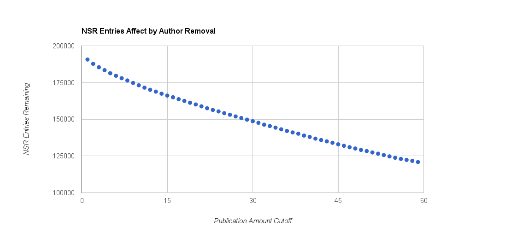
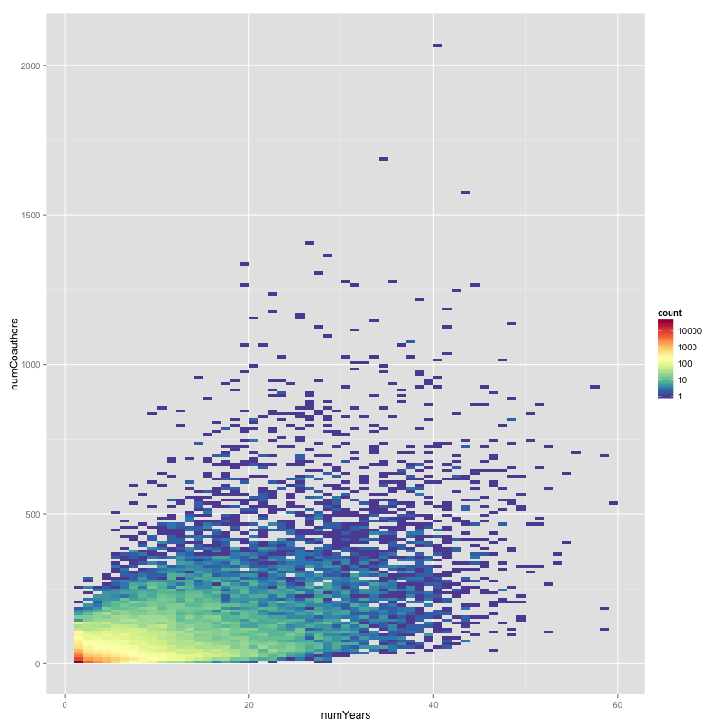
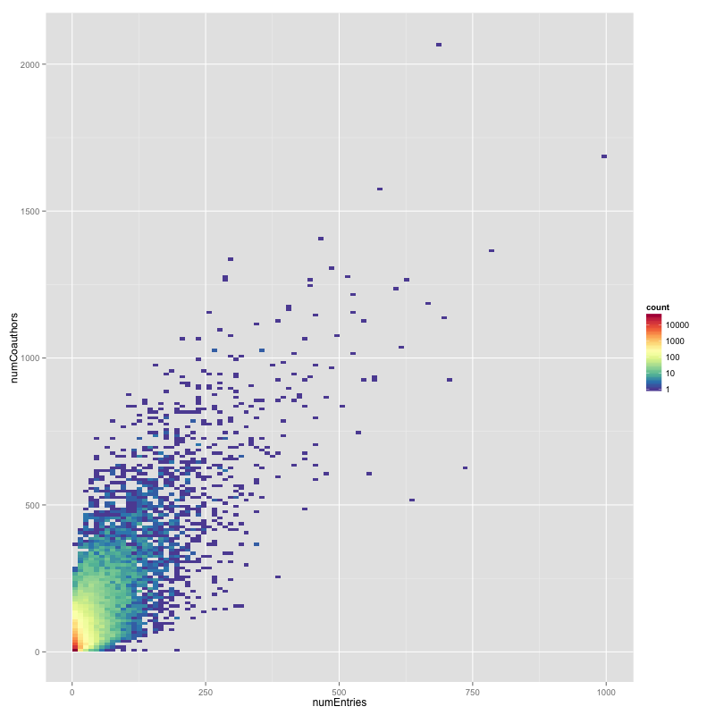
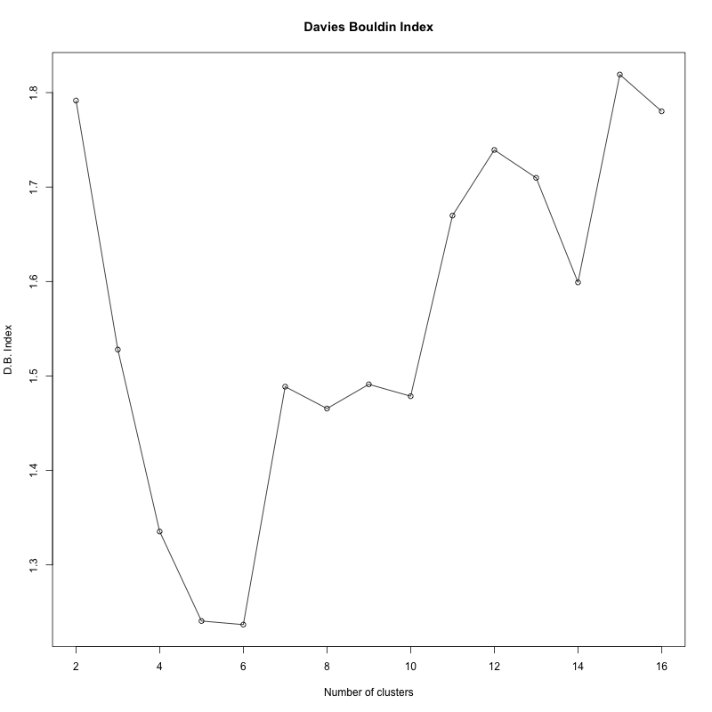
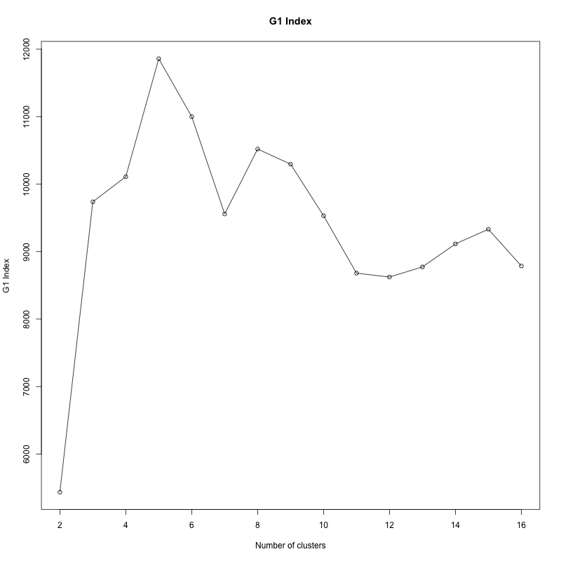
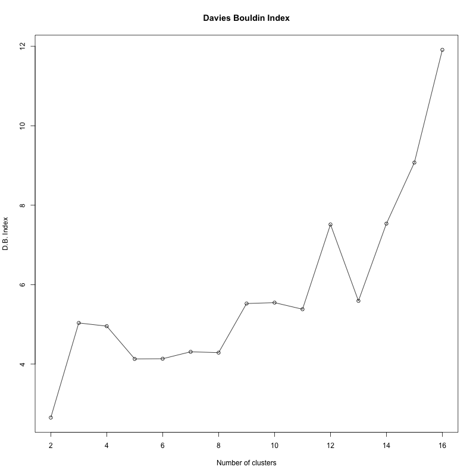
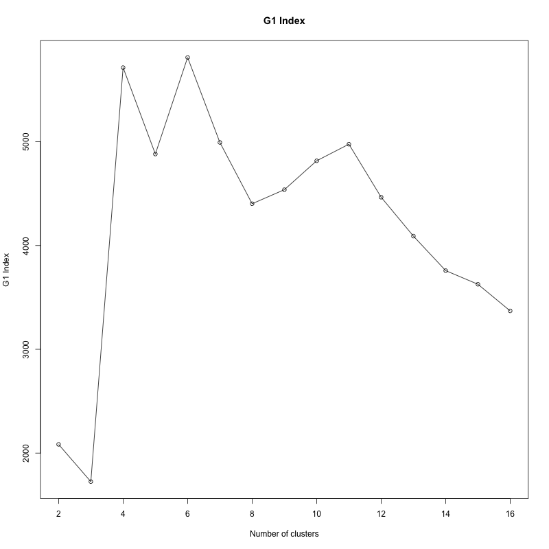
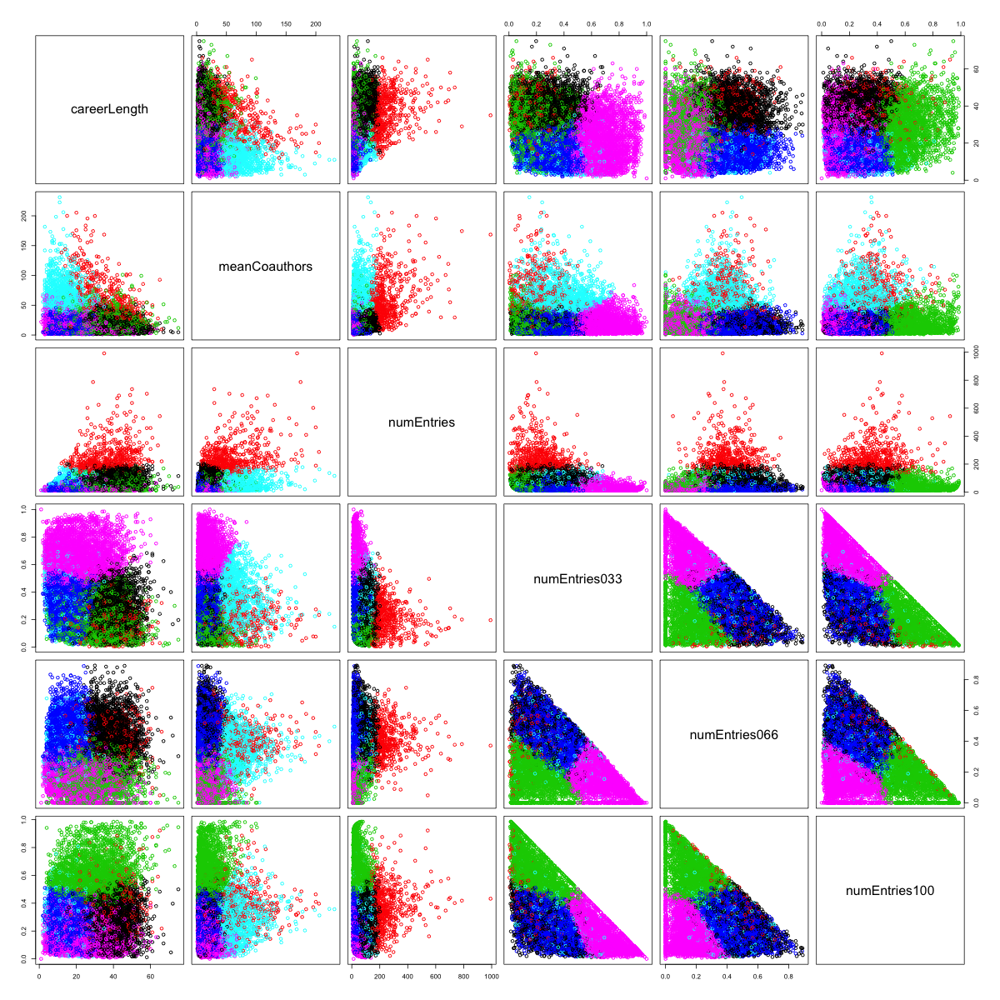

%- TODO cite multiple times: a-priori algorithm
%- Code in appendix? Additional screenshots in appendix?
%- Custom bibliography styling?
---
title:  'Data Mining and Exploration of the Nuclear Science References'
author:
- name: Andrew Valencik
  affiliation: Saint Mary\'s University
author: Andrew Valencik
date: December 18th 2015
bibliography: bibliography.yaml
csl: american-physics-society.csl
link-citations: true
linestretch: 1.6
...

\listoffigures
\listoflistings
\listoftables


Introduction
============

%- IR and vertical search
Information retrieval has been repeatedly improved by large search engines like Google, Yahoo, DuckDuckGo, and more.
Vast quantities of information are now easily retrieved on an extensive array of subjects.
Scientific literature has received special attention through projects like [Google Scholar](https://scholar.google.ca) or [Microsoft Academic Search](http://academic.research.microsoft.com).
These projects are generalized to accommodate all sciences.
Information retrieval and data exploration can be improved by customizing an application to a specific domain.

%- NNDC and NSR
The United States [National Nuclear Data Center](http://www.nndc.bnl.gov) (NNDC) prepares an evaluated database of nuclear science literature that poses a rich opportunity for knowledge discovery directed at scientific work and study.
The academic field of nuclear science is over one hundred years old, starting with the discovery of radiation @becquerel.
This discovery represents the first of many entries in the Nuclear Science References database, collected, cataloged, distributed, and evaluated by the National Nuclear Data Center @Kurgan200603.
The Nuclear Science References, or NSR, has over 210,000 entries documenting the body of nuclear science literature, which provides the opportunity for knowledge discovery on the literature's metadata.
The metadata that the NSR provides is contributed and maintained by neutral third party experts from the NNDC.
This fact separates the information in the NSR from metadata available through services such as [ResearchGate](http://researchgate.net/).

%- Data mining + physics
This work is a cross disciplinary effort, combining semantic information of nuclear physics literature and data mining techniques to build a custom application for data exploration and information retrieval in nuclear science.
The practice of knowledge discovery and data mining on the NSR dataset can reveal trends in the collective scientific study of nuclear structure, processes, and detection.
These data are presented through a web application that extends the existing facilities of the Nuclear Science References web retrieval system @NSRweb.
The ultimate goal of this work is to enable further analysis on the body of nuclear science literature.

%- Background info spread throughout
This is a thesis that applies science from one domain to science from another domain.
To facilitate understanding by all readers, no matter their expertise, background information is placed in the thesis close to where it is used.
Thus, this thesis has no "theory" chapter, as essential knowledge is provided in the chapters that require it.

%- Disclaimer: Not a social scientist or graph theorist
The primary contribution of this thesis is the construction of tools and a framework for future analysis into the valuable NSR dataset.
Assertions about the interpretation of results from these tools have been avoided.
The goal of this work was not to study physics or physicists, but instead to apply expertise in nuclear science and data analytics to enable diverse researchers, including network analysts and social scientists to explore the NSR dataset.
The resulting work is flexible enough, by design, to be easily adapted to the needs of anyone investigating the NSR.

## Thesis Organization
The existing NSR website and interface are outlined in this introduction chapter.
Additionally, the web application created as a result of this work is discussed.

The transformation of the provided raw data is discussed in the [Data Preparation](#data-preparation) and [Data Representation](#data-representation) sections.
The data are stored in a database as discussed in [The Database](#the-database).

Chapter 3 is the first exploration of the NSR data and the database created with our data representation.
We discuss the types of queries that can be made on the data, show some examples, and discuss the results.
The [Author Contributions](#author-contributions) section analyzes how the authors of works catalogued in the NSR contribute to the NSR collection as a whole.
Visualizations for the queries discussed in this chapter are shown.

Chapter 4 introduces the concept and tools for analyzing the NSR data as a network graph.
A brief overview of graph theory concepts and terminology is given.
We discuss different queries that can be used to produce graphs of the NSR data in the [Data Graphs](#data-graphs) and [Nuclide Graphs](#nuclide-graphs) sections.
The Libraries used are discussed as well as an exportation feature.

Chapter 5 details the usage of tools and techniques from text mining.
A paper recommender system is built in the [Similar Papers](#similar-papers) section by using a modification of cosine similarity.
The second component of this chapter analyzes author names to build a system of finding authors who may have multiple identifications in the NSR.

Chapter 6 discusses two common data mining techniques and their applications with regard to the NSR data.
Association mining is performed on nuclides in papers, author names in papers, and author names in selectors.
In the [Cluster Analysis](#cluster-analysis) section, K-means is used to cluster authors.

Finally, we review the contributions and discuss future works in the [Conclusions](#conclusions) chapter.

## The Nuclear Science References Website
%- Link to Data section
Please note, the data that these interfaces interact with and return as results are fully discussed in the [Data and Database](#the-data-and-database) section.

The NNDC maintains the [NSR website](http://www.nndc.bnl.gov/nsr/) which serves a web interface to the Nuclear Science References database.
The functionality and architecture of the NSR database and web site is discussed by Pritychenko in @NSRweb.
Four search interfaces are offered: quick search, text search, indexed search, and keynumber search.
The quick search interface is shown in Figure @fig:nsrweb1.

 {#fig:nsrweb1}

%- Quick Search
The quick search functionality is the most commonly used interface @NSRweb.
It enables searching by author name, nuclide, or reaction.
Two types of filters are available to limit the results: a year range, and reference type which can return only experimental or theory entries.
Each of the search fields show examples of the type of search as well.
For example the author field shows a search for an author using their first initials and their last name, or only their last name.

%- Text Search
The text search interface enables text searching in the title, keywords, or both fields.
The search is not case sensitive and requires a search string of at least three characters in length.
Phrases can be used by enclosing them in quotes.
The user can specify a publication year range, or choose a date to filter when the entries were added to the database.
Additionally the user can enable 'primary only' or 'require measured quantity' flags.
The results can be sorted in ascending or descending order and presented in HTML, BibTex, Text, Keynum, or Exchange formats.
The quick search results do not offer these output customizations.

%- Indexed Search
%- Author fingerprinting will improve the author 'browse' button
The interface for indexed searching is similar to the Text Search.
The most important difference is the functionality offered by the browse buttons for the search parameters.
The user can select a parameter of the following types:
Author, FirstAuthor, Nuclide, Target, Parent, Daughter, Subject, Measured, Deduced, Calculated, Reaction, Incident, Outgoing, Journal, Topic, Z(range).
%- TODO [^link-data-section].
For each of the types available the browser button will redirect to another page that either details the possible values or provides another search through the possible values.
For example, Author and First Author direct to a simple search interface that allows some partial matches against the list of known authors.
%- TODO ROBY have you compared this to your known multiples?

%- TODO [^link-data-section]: These parameters are explained in the [NSR Data](#nsr-data) section.

%- Result Analysis
Search queries are remembered and presented in the 'Combine View' tab.
Users can combine the results of recent queries with boolean logic.
Analysis is offered on the search queries which displays how many nuclides, authors, journals, and publication years the query involved.

## NSR Explorer - Web Application
As a contribution to this thesis, we have developed a web application, NSR Explorer, to increase accessibility to exploration of the Nuclear Science References data.
This includes the authors documented, the entries recorded and keyworded, their links, and all available metadata for the nearly 120 years of records.
The application makes use of a web interface to aid in increasing accessibility.
All that is required to use the application is a modern web browser.
Interactive visualizations are used to encourage exploration of the data.
Additionally, the new database structure that is developed in this work enables searches that were previously cumbersome or impossible.

The web application presents a single search interface as shown in Figure @fig:webapp-search.
This interface can take queries with a specified command, or the command can be inferred, based on the type of data that is input by the user.
For example, if the user inputs a string that matches an author name, the application retrieves a profile page for that author.
An example profile page for input "R.A.E.Austin" is shown in Figure @fig:author-profile.
The author profiles combine information discussed in the [Data Summarization](#data-summarization) and [Cluster Analysis](#cluster-analysis) sections.

If the user inputs a year or year range such as `1989` or `1970-1979` a summary of the data for those years is shown.
This summary uses information and visualizations discussed in [Data Summarization](#data-summarization).

 {#fig:webapp-search}

 {#fig:author-profile}

%- TODO replace with a discussion of choosing views
Visualizations of a network of collaborators are retrieved with the `collab:` command.
For example, `collab:R.A.E.Austin` will retrieve a network graph of all the authors who have published with `R.A.E.Austin`.
Additionally, the `collab:` command can take a nuclide as an input and generate a network graph of all authors who have published on that nuclide.
Analysis of the network graphs is further discussed in [Network Analysis and Visualization](#network-analysis-and-visualization).

%- TODO replace with a discussion of choosing views
The `simpapers:` command returns a list of NSR entries that are considered similar to the input selection.
The command can take an author's name or NSR Keynumber as valid inputs [^keynumber-link].
An example for author "A.J.Sarty" is shown in Figure @fig:simpapers-author.
The method by which NSR entries are determined to be similar is discussed in the [Similar Papers](#similar-papers) section.

[^keynumber-link]: NSR Keynumbers are the unique identifcation code given to each NSR entry. They are further discussed in the [NSR Data](#nsr-data) section.

The Data and Database
=====================
%- Data Structure and Representation?
The United States National Nuclear Data Center (NNDC) has composed the Nuclear Science References (NSR) database.
A full database dump of the NSR was acquired on January 29th 2014 @borris-data.
For simplicity, the data acquired from the NNDC on that date will be referred to as if it were the complete NSR database.
All efforts have been taken to ensure the research procedures can easily be extended and repeated on new NSR data.

%- Motivation
The work discussed in this chapter is motivated by the need to easily retrieve information from the NSR data and manipulate it to facilitate answering questions.
We first discuss the NSR data as provided by the NNDC @borris-data.
Special attention is given to the keyword abstracts as the metadata they provided is what sets the NSR data apart from other bibliographic databases.
Then the method for converting the provided raw data into our JSON representation is discussed.
The MongoDB database software is introduced and its aggregation framework is discussed.
The mechanics of transform and importing the data are not fully described in this text.
Instead, the conversion and importing procedures have all been scripted and made available as included source code in the Appendix.

## NSR Data
%- NSR EXCHANGE format discussion
The NSR has 9 possible types of fields which are shown in Table @tbl:NSRidentifiers.
Each entry can only have one of each field type except for `<KEYWORDS>` and `<SELECTRS>` which exist as a pair and an entry can have multiple pairs of them.
An example of the raw data for a single paper can be seen in Snippet \ref{blk:rawNSRentry}.

``` {#blk:rawNSRentry .text caption="An example NSR entry showing the raw NSR EXCHANGE data format." fontsize=\small baselinestretch=1}
<KEYNO   >1988AB01                                                              &
<HISTORY >A19880309 M19880315                                                   &
<CODEN   >JOUR PRVCA 37 401                                                     &
<REFRENCE>Phys.Rev. C37, 401 (1988)                                             &
<AUTHORS >A.Abzouzi, M.S.Antony                                                 &
<TITLE   >Calculation of Energy Levels of {+232}Th,{+232}{+-}{+238}U for K(|p) =&
 0{++} Ground State Bands                                                       &
<KEYWORDS>NUCLEAR STRUCTURE {+232}Th,{+232},{+234},{+236},{+238}U; calculated le&
vels,band features. Semi-empirical formalism.                                   &
<SELECTRS>N:232TH;A. N:232U;A. N:234U;A. N:236U;A. N:238U;A. C:OTHER;A.         &
<DOI     >10.1103/PhysRevC.37.401                                               &
```

Identifiers   Description
-----------   -----------
`<KEYNO   >`  Reference keynumber
`<HISTORY >`  Administrative record
`<CODEN   >`  Standard form reference
`<REFRENCE>`  Free text reference
`<AUTHORS >`  Author names
`<TITLE   >`  Reference title
`<KEYWORDS>`  Keyword abstract
`<SELECTRS>`  Indexing parameter list
`<DOI     >`  Digital object identifier

Table: The nine legal record identifiers from the Nuclear Science References Coding Manual @nsr-manual. {#tbl:NSRidentifiers}

The `<KEYNO   >` field is a unique key number assigned to each NSR entry.
The date on which a particular entry was added to the database or last modified is encoded in the `<HISTORY >` field.
The `<CODEN   >` and `<REFRENCE>` fields contain information about the journal or other type of resource the document came from.
The `<AUTHORS >` field is a comma-separated list of author names.
The author list is one of the key relational components of the data, establishing links between NSR entries and other authors.
The `<TITLE   >` field is a free text field representing the title of the reference with a custom set of abbreviations for special characters like Greek letters.
These abbreviations are detailed in the NSR coding manual @nsr-manual.
In this work, the abbreviations have been translated to \LaTeX.
The `<DOI     >` field contains the digital object identifier code that uniquely links to the source document's metadata.
While not strictly necessary, the DOI often has a URL associated with it that links to the source document on the website of the publishing journal @wiki-DOI.
The two fields, `<KEYWORDS>` and `<SELECTRS>` have the most structure and require special attention which is given in [Keyword Abstracts](#keyword-abstracts).

### Keyword Abstracts
The `<KEYWORDS>` field , or keyword abstract, is written by the maintainers of the NSR database, and then used to generate the `<SELECTRS>` field @nsr-manual.
Each NSR entry is read and then a keyword abstract is manually created to reflect the physical systems that were studied and measured in the work.

> "What distinguishes NSR from more general bibliographic databases is the level of detail provided in the keyword abstracts." @nsr-manual

Keyword abstracts each have one of the following major topics:
`NUCLEAR REACTIONS`, `RADIOACTIVITY`, `NUCLEAR STRUCTURE`, `NUCLEAR MOMENTS`, `ATOMIC PHYSICS`, `ATOMIC MASSES`, and `COMPILATION`.
To accommodate work that spans multiple topics, NSR entries can have multiple keyword abstracts.
Following these major topics are one or more indexed sentences.
These sentences describe the elements of the physical system studied, and any measurements that were made.
For example, the `<KEYWORDS>` field in Snippet \ref{blk:rawNSRentry} encodes that the referenced work calculated energy (implied) levels and band features using a semi-empirical formalism for
$^{232}\mbox{Th}$, $^{232}\mbox{U}$, $^{234}\mbox{U}$, $^{236}\mbox{U}$, and $^{238}\mbox{U}$.

It is this structure that provides the most semantic information about the NSR entry.
Thanks to the careful work of the NSR maintainers, the `<KEYWORDS>` and resulting `<SELECTRS>` fields reveal the NSR entry's content in a machine-readable manner.
Without this information any data mining project using the content of the NSR entries would require raw text access to the either the full document or the abstract.
Getting full text access to thousands of papers is often significantly challenged by copyright laws.

The selectors are computer generated from the keyword abstracts.
The schema used in this work, as discussed in [Data Representation](#data-representation), has `<SELECTRS>` parsed into a 3 dimensional array with `type`, `value`, and `subkey` variables.
The following quote from the NSR Coding Manual @nsr-manual describes the valid `type`s:

> N, T, P, G, R, S, M, D, C, X, A, or Z, which stand for nuclide, target, parent, daughter, reaction, subject, measured, deduced, calculated, other subject, mass range, and charge range, respectively. @nsr-manual

The type of data for `value` changes based on the value of the `type`.
For `type`s N, T, P, and G, the `value` is a nuclide written in the form AX with A equal to the mass number, and X equal to the chemical symbol.
The value for A may have any number of digits.
X may be one, two, or three letters.
The `subkey` variable is used to link together multiple selectors of the same keyword sentence.

## Data Preparation
The NSR data are maintained in a custom EXCHANGE format @nsr-manual.
This format is flat text that is not suitable for direct analysis.
The data needs to be parsed into data structures for analysis and use.
The approach least likely to introduce errors is to transform the data into a common format for which parsers already exist.

[JavaScript Object Notation](http://json.org), or JSON, was chosen as the data format for this work.
While other data formats could have sufficed (perhaps [YAML](http://yaml.org), for example), certain common data formats like comma-separated values (csv) would have been more difficult.
JSON met the following requirements: support for arrays, openly available, well-supported, with an established user community, and it was familiar to the author.
The requirement for array support is discussed further in the [Data Representation](#data-representation) section.

Each NSR entry will be represented as a JSON object [^json-document].
JSON objects are composed of keys and values.
A key is a unique string that maps to a value.
A value can be a string, a number, an array, or another object.
Similarly, arrays can contain strings, numbers, objects or additional arrays.
The arrays in JSON may be considered as ordered lists by some as they can contain elements of mixed types.
However, the arrays in the NSR data do not contain mixed types.
Snippet \ref{blk:rawNSRJSON} shows an example of a JSON object and the final representation of an NSR entry.

[^json-document]: These objects are referred to as documents once stored in the database. See [The Database](#the-database).

%- NSR to JSON
Transforming the NSR data to a collection of JSON objects is possible with a series of search and replace commands using regular expressions.
The commands are recorded in the Perl[^why-perl] script `parseNSRtoJSON.pl` available at [github.com/valencik/mastersAPSC](https://github.com/valencik/mastersAPSC).
The result of the scripts is a file with a valid JSON object for each NSR entry.
The scripts can be used to reproduce the transformation data as new NSR data becomes available.

[^why-perl]: Perl is used here as it remains one of the best RegEx implementations, and allowed for scripts that read as a simple ordered list of transformations to apply.

%- Data representation
The data representation is the result of careful consideration of the types of queries to be made on the data.
The data schema uses data types that best reflect how the data will be used.
This is important as the data schema will determine the types of queries we can make on the database.
For example, with data spanning 120 years, it is helpful to filter the data based on a numeric year value.
As such the `year` value in the data schema is an integer.
This allows the construction simple queries to get NSR entries from a specific year or from a year range.
Queries and example code are discussed in [The Database](#the-database).

%- Author data structure
The list of authors for a NSR entry is a more complicated data type as it involves multiple elements.
It is best represented as an array of strings, with each unique author being a separate string element in the array.
The representation of the author list as an array instead of a free text field is beneficial as the author list is now a data structure.
With this structure comes information and ease of computing different properties of that data.
The length of the array tells us how many authors collaborated on a given NSR entry.
And since arrays are ordered, we can easily determine the first author[^first-author] of an entry.
While it is possible to extract the same information from a free text field, parsing our data into data structures creates structures that are compatible with many tools, such as [MongoDB](#mongodb).
Users of the database can now sort entries by their number of authors, or count the number of times someone was first author.
Additionally, almost every aggregation query[^see-aggregation] made in our work relied on using array specific operations on the author array at some stage.

[^first-author]: The significance, if any, of being first author changes amongst journals. A clever data scientist will want to consider the `<REFRENCE>` information along with any first author analysis.
[^see-aggregation]: See the [MongoDB Aggregation Framework](#mongodb-aggregation-framework) section for more details.

%- Getting into SQL vs NoSQL here...
It is possible to store the NSR data in a relational model.
In a relational database the authors would have their own tables, separate from papers, as they are separate entities.
This inefficient choice would entail a table and data schema created for the papers and then a separate table and schema for the authors, and similarly for keywords, selectors, and history.
It is more efficient to convert the original data into a data schema that uses arrays.
This is the primary motivator for not using a standard relational database.

## Data Representation
An example of the final data representation we use is shown in Snippet \ref{blk:rawNSRJSON}.
It is a JSON object for the NSR entry with keynumber `1988AB01`.
The `_id` value is a string used as the unique identifier in the MongoDB collection (as discussed in [The Database](#the-database)), its value is the same as the `<KEYNO   >` of the original NSR entry.
The `year` value is an integer and represents the year the resource was published.
The `history` value is an array that contains encoded information representing dates when the original NSR document was added and/or modified.
The `code` value is a string copy of the `CODEN` value in the NSR data.
The `type` value is a string that describes what publication type (journal, thesis, conference paper, etc) the resource is.
The `reference` value is a string copy of `REFRENCE` from the NSR data.
The `authors` value is an array of string elements representing the authors who published that resource.
The `title` value is a string, formatted for \LaTeX, that represents the title of the resource.
The `keywords` value is an array of strings that represent the KEYWORD sentences as described in the NSR manual.
The `selectors` value is an array of objects that contain the type, value, and subkey information generated by the keyword entry by the NSR.
The `DOI` value is a string of the Digital Object Identifier for the published resource.
Finally, the `simPapers` value is an array that contains objects, where each object refers to another NSR entry that is above a minimum similarity threshold.
The objects in `simPapers` are determined via calculation which is discussed in [Similar Papers](#similar-papers).

``` {#blk:rawNSRJSON .json caption="An example NSR entry showing the final data representation as a JSON object. Note that newlines are ignored in JSON and only present for readability. Also note that the order of keys and values in an object is not garunteed to be preserved, as can be seen from the \texttt{selectors} objects." fontsize=\footnotesize breaklines=true baselinestretch=1}
{
  "_id": "1988AB01",
  "year": 1988,
  "history": [ "A19880309", "M19880315" ],
  "code": "JOUR PRVCA 37 401",
  "type": "JOUR",
  "reference": "Phys.Rev. C37, 401 (1988)",
  "authors": [ "A.Abzouzi", "M.S.Antony" ],
  "title": "Calculation of Energy Levels of {+232}Th,{+232}{+-}{+238}U for K(\\pi ) = 0{++} Ground State Bands",
  "keywords": [ "NUCLEAR STRUCTURE {+232}Th,{+232},{+234},{+236},{+238}U; calculated levels,band features. Semi-empirical formalism." ],
  "selectors": [
    { "type": "N", "value": "232TH", "subkey": "A" },
    { "value": "232U", "subkey": "A", "type": "N" },
    { "type": "N", "value": "234U", "subkey": "A" },
    { "subkey": "A", "type": "N", "value": "236U" },
    { "type": "N", "value": "238U", "subkey": "A" },
    { "type": "C", "value": "OTHER", "subkey": "A" }
  ],
  "DOI": "10.1103\/PhysRevC.37.401",
  "simPapers": [
    { "score": 0.90890002250671, "paper": "1992BAZJ" },
    { "score": 0.89768290519714, "paper": "1994CH14" },
    { "score": 0.88365876674652, "paper": "1979FAZX" },
    { "score": 0.81536161899567, "paper": "1983DU10" },
    { "score": 0.8083301782608, "paper": "1979CH02" },
    { "score": 0.7871305346489, "paper": "1984PE01" },
    { "score": 0.76397824287415, "paper": "1960DU10" },
    { "score": 0.76397824287415, "paper": "1981SE07" },
    { "score": 0.76397824287415, "paper": "1995KU31" },
    { "score": 0.76397824287415, "paper": "1999BU03" },
    { "score": 0.76397824287415, "paper": "2011NA24" },
    { "score": 0.76335608959198, "paper": "1985ZH08" },
    { "score": 0.74211376905441, "paper": "1975IVZM" },
    { "score": 0.73295497894287, "paper": "1981MA35" },
    { "score": 0.73295497894287, "paper": "1996ZH29" },
    { "score": 0.72842478752136, "paper": "1979ES06" },
    { "score": 0.72127419710159, "paper": "1982MI12" },
    { "score": 0.72127419710159, "paper": "1983MI19" },
    { "score": 0.70403093099594, "paper": "1973IM02" }
  ]
}
```

## The Database

Database systems are an important tool in information retrieval.
Large datasets should be organized in databases to provide useful abstractions for users.
E. F. Codd discusses this in his 1970 paper @large-data-banks, as such the idea is not new nor uncommon.
In the [Data Preparation](#data-preparation) and [Data Representation](#data-representation) sections we discussed the transformation of the provided data into our own representation.
The users of our application, NSR Explorer, should not be concerned with the internal representation of data [^data-banks-dev].
The resulting data representation is imported and stored in a database to enable the NSR Explorer web application to query the data.
This section will detail our choice in database software, how queries are made, and briefly introduce some performance considerations.

[^data-banks-dev]: The work in @large-data-banks goes further to suggest that even the developers of the NSR Explorer application should not be concerned about the internal data representation. This should be abstracted by the relational model of data discussed in that work.

### MongoDB
[MongoDB](https://www.mongodb.org) is an open source NoSQL document store database system.
It was chosen because it is open source, easy to use, well supported, and the author is familiar with it.
Additionally it has nice features such as JSON support, an aggregation framework (see [MongoDB Aggregation Framework](#mongodb-aggregation-framework)), and is easy to set up.

Other NoSQL databases like CouchDB support JSON and may have been acceptable as well.
MongoDB and CouchDB are both comparatively new database systems.
Postgres also supports JSON and is a mature database system.
Despite the prevalence of MySQL, it was not chosen because it is a relational database and would thus not support the arrays in the data schema as outlined in [Data Preparation](#data-preparation).

In a relational database system such as MySQL, each NSR entry would have to be split up, with different pieces of information populating different database tables.
Authors would be a type of entity in their own authors table, that each NSR entry in an NSR table would link to.
This type of relationship would be necessary for keywords and selectors as well.

As reported in the section [Data Preparation](#data-preparation), a JSON object was constructed for each entry in the NSR data.
We create a database in MongoDB titled `masters`.
This database will hold multiple collections.
MongoDB collections store multiple documents.
Each JSON object is a document in MongoDB terminology.
To populate the MongoDB database, these JSON structures were flattened into a single file, and imported into a MongoDB collection using the [`mongoimport` tool](http://docs.mongodb.org/manual/reference/program/mongoimport/).
After importing was completed, there were 212835 documents in the MongoDB collection, one for each entry in the NSR database.

The `pymongo` module @pymongo-doc can be used to query our database using the Python programming language.
Example python code to retrieve all NSR entries from the 1970s is given in Snippet \ref{blk:NSR1970s}.
The first line imports the `pymongo` module which enables communication with a MongoDB database.
We then establish a connection with the local database titled `masters` and save that connection in the `db` object.
Finally we use the `NSR` collection of the database and pass the `find` method our query expressed as a JSON object.
Note the use of `$gte` and `$lt` which correspond to the mathematical operators greater than or equal to and less than.

``` {#blk:NSR1970s .python caption="Python code to get all NSR entries from 1970 to 1979." fontsize=\small baselinestretch=1}
import pymongo
db = pymongo.MongoClient()['masters']
db.NSR.find({"year": {"$gte": 1970, "$lt": 1980}})
```

### Indexing the Data
The performance of the database can be optimized by indexing on important or frequently referenced fields such as "authors" and "year".
Indexing speeds up search queries in a manner similar to sorting a series of data elements.
MongoDB allows for many different types of indexes.
We create single field indexes on the `_id`, `year`, `authors`, `selectors.type`, `selectors.value`, and `type` fields[^dot-notation].
This enables fast lookups for documents[^documents] according to the indexed fields.
For example it would be quick to find all the documents with type 'Journal' and year '1983'.
Text indexes can also be created to enable fast search of words in the titles or keyword fields.
This has not been done as the titles and keyword fields are not used in our analysis.
We instead make use of the list of selectors to infer the topic of a given NSR entry.

[^dot-notation]: We use dot notation to denote that `selectors.type` refers to the `type` field of the `selectors` object.
[^documents]: Recall that MongoDB is a 'document' store database, and each NSR entry has been imported as a 'document' in the MongoDB collection.

%- Other concerns and code
There are additional concerns in hosting a database server and web application.
Typically a database is hosted on a dedicated server, separate from the web application, and perhaps not publicly facing.
These issues, and additional performance configurations will not be further addressed in this work.
They are however addressed in the code repository for this work available at: [github.com/valencik/mastersAPSC](https://github.com/valencik/mastersAPSC).

### MongoDB Aggregation Framework
The MongoDB aggregation framework is powerful and enables data manipulation similar to that obtain in SQL[^sql] via the `GROUP BY` operation @wiki-mongodb.
There are a handful of simple aggregation operations that can be piped together to build complex queries.
All aggregation operations take in a list of data documents, manipulate them in some way, and then output the results to the next operation.

[^sql]: SQL or Structured Query Language is a common programming language for interacting with data.

The `match` operation acts as a filter, returning only the documents that meet the specified criteria.
The `project` operation manipulates each individual document renaming, omitting, or changing each field according to the input parameters.
The `unwind` operation acts on an array field of the input documents.
It creates a new document for each element in the array, with all fields duplicated except the array field which is equal to the element.
The `group` operation can combine similar documents and can perform calculations based on that combination.
A common usage is to sum a value, perhaps price, of all the input documents.

There are some additional, more straightforward, operations such as `sort`, `limit`, `skip`, and `redact`.
The final results from an aggregation query can be saved to a collection using the `out` operation, or can be returned to the calling application through the many MongoDB APIs.

%- Documentation links
MongoDB is currently a popular database and there exist tutorials and example applications.
The MongoDB documentation is well written and provides a good overview of the aggregation framework @mongo-doc.
All MongoDB interactions in this work use the python driver, `pymongo` @pymongo-doc.

### Future Work - The Database
An extension to this work is to support additional database systems.
The prevalence of MySQL is motivation to support it.
However, in continuing with the desire to use a NoSQL database system, the work could be extended to support CouchDB with relative ease.

## Conclusion
We have described the NSR data as provided by the NNDC @borris-data.
Scripts have been prepared to transform the NSR EXCHANGE format into a list of JSON objects, one for each NSR entry.
The JSON objects have been imported into a MongoDB database called `masters` in a collection called `NSR`.
Basic queries as well as aggregation queries have been introduced.
The system architecture for querying the data is complete as described.
The sections following this will describe different analyses and results from querying the data.


Data Summarization
==================
%- What? Created summaries and ranked info in a web app.
%- Why? Visualizations are important in understanding data. As are summaries and rankings.
%- How? MongoDB aggregations to D3 charts.
This chapter introduces the queries that can be run on the database constructed in [The Data and Database](#the-data-and-database) section.
Examples are shown that filter the data using constraints on different data types such as year ranges or author names.
Bar charts and pie charts are introduced for visualizing the data.

%- Motivation
Through data summarization we can learn the first-order characteristics of the data set.
Our goal was to obtain a broad perspective of its structure and composition.

## Data Composition and Queries
We can construct queries to reveal the composition of the NSR data.
For example, there are 212835 entries[^our-data-set] that span from 1896 to 2014.
We can answer questions such as "What percentage of all entries are journal articles?"
As Table @tbl:typesAll shows, the majority of the document types in the NSR are journal articles.
The next most popular are reports and conference proceedings.
There are fewer books and preprints than there are unknown and unlabeled entries.
The python code to produce these results is shown in Snippet \ref{blk:typesAllCode}.

[^our-data-set]: Recall that the data set used in this work is a snapshot of the entire NSR data as downloaded in January 2014.

Type       Amount   Percentage
----       ------   ----------
THESIS     1934     0.908\%
PREPRINT   779      0.366\%
BOOK       107      0.050\%
PC         1661     0.780\%
CONF       16836    7.910\%
REPT       24554    11.53\%
JOUR       165477   77.74\%
UNKNOWN    1487     0.698\%

Table: The amounts of each type of NSR entry in the whole data set. {#tbl:typesAll}

``` {#blk:typesAllCode .python caption="The aggregation query to get amount of types in the NSR." fontsize=\small baselinestretch=1}
import pymongo
db = pymongo.MongoClient()['masters']
db.NSR.aggregate([{"$group": {"_id": "$type", "count": {"$sum": 1}}}])
```

%- Slice of author
The summarization analysis can conveniently be applied to subsets of the data.
The data can be filtered to only involve a particular author.
This provides answers to questions such as "what percentage of A.J.Sarty's contributions were journal articles?"
Table @tbl:typesAJSarty shows A.J.Sarty has primarily worked on journal articles, with one preprint article.
The code for this query, which is shown in Snippet \ref{blk:typesAJSarty}, simply adds a `$match` operation to Snippet \ref{blk:typesAllCode}.

Type       Amount   Percentage
----       ------   ------
PREPRINT   1        5\%
JOUR       21       95\%

Table: Different types of NSR entries for author A.J.Sarty. {#tbl:typesAJSarty}

``` {#blk:typesAJSarty .python caption="Aggregation query to get the types of an author's publications." fontsize=\small baselinestretch=1}
import pymongo
db = pymongo.MongoClient()['masters']
db.NSR.aggregate([{"$match": {"authors": "A.J.Sarty"}},
                  {"$group": {"_id": "$type", "count": {"$sum": 1}}}])
```

%- Slice of time
The data can also be partitioned or sliced in time, supporting questions such as "what percentage of 1989 entries are journal articles?"
As we can see from Table @tbl:types1989 $72.06\%$ of the NSR entries in 1989 are journal articles.
This percentage is different than that of the whole work (as shown in Table @tbl:typesAll), but not by a significant amount.
It does highlight a particular point of interest, i.e. that the data are not uniform.

Type       Amount   Percentage
----       ------   ----------
THESIS     16       0.398\%
PREPRINT   21       0.523\%
BOOK       7        0.174\%
PC         14       0.348\%
CONF       331      8.248\%
REPT       732      18.24\%
JOUR       2892     72.06\%

Table: Different types of NSR entries in 1989. {#tbl:types1989}

%- Rankings
For a particular selection of NSR data, it is useful to know the rankings for important data fields.
For example, when a user searches an author on the application they are presented with a ranked list of their most frequent coauthors, keywords, and nuclides.
This type of analysis can of course be applied to the whole dataset as well.
Table @tbl:prolific-authors shows the authors with the highest count of NSR entries in the entire database.

Author              Number of Publications
------              ----------------------
R.V.F.Janssens                992
M.P.Carpenter                 787
A.Faessler                    736
J.H.Hamilton                  703
I.Ahmad                       694
B.A.Brown                     690
I.Y.Lee                       671
W.Greiner                     637
A.O.Macchiavelli              624
T.L.Khoo                      614

Table: The top 10 most prolific authors in the NSR database. {#tbl:prolific-authors}
%- TODO perhaps reduce to 5 to avoid page splitting

## Author Contributions
%- Demonstrate that removing all single publication authors is not as harmful as it might seem
There is a wide range in publication numbers among the roughly $100,000$ authors in the NSR.
Table @tbl:prolific-authors shows the upper bound in publication numbers, and $41254$ authors share the lower bound of one publication.
These are authors with different publication traits (a topic that is further explored in [Cluster Analysis](#cluster-analysis)).
We want to enable discovery about the structure of author contributions.
Are the majority of NSR entries contributed by the many authors who publish once or the few with hundreds of publications?

The database can be used to answer a similar question:
How many of the NSR entries are affected if every author who contributed to fewer than a given number of entries is removed?
First, every paper is taken and duplicated for every single author in that paper's author list.
There is now a database object for each author in each paper.
Each time an author appears their publication count increments.
Next, each database object that has an author with a publication count below the cutoff is removed.
Finally, the unique remaining NSR entries are the ones that have authors with more than the given publication count.
Table @tbl:papersWithoutNAuthors shows the number of NSR entries that remain after all the authors with a specified publication count are removed[^code-papersWithoutNAuthors].
Note that the starting number is $190654$ not $212835$ as quite a few NSR entries do not have an author field.
Table @tbl:typesWithoutAuthors shows a breakdown of the NSR entry types that do not have authors.
A large percentage of those entries without author fields are reports and conference proceedings[^no-author-jour].

[^code-papersWithoutNAuthors]: The code to produce the results in Table \ref{tbl:papersWithoutNAuthors} is shown in Appendix Snippet \ref{blk:papersWithoutNAuthors}

[^no-author-jour]: Of the $5564$ journal articles without an author field, $5489$ were written between 1970 and 1980.

Entry Number Cutoff   Entries Remaining   Difference
-------------------   -----------------   ----------
1                     190654
2                     187741              2913
3                     185404              2337
4                     183410              1994
5                     181315              2095
6                     179606              1709
7                     177945              1661
8                     176390              1555
9                     174702              1688
10                    173117              1585
11                    171509              1608

Table: NSR entries affected by removal of authors with a publication count less than the cutoff. {#tbl:papersWithoutNAuthors}

Type       Amount
----       ------
UNKNOWN    33
PC         48
CONF       4614
PREPRINT   78
THESIS     968
REPT       10876
JOUR       5564
Total      22181

Table: Types without any authors. {#tbl:typesWithoutAuthors}

The relationship between publication amount cutoff and NSR entries remaining is consistent.
The same data in Table @tbl:papersWithoutNAuthors is plotted in Figure @fig:papersWithoutNAuthors.

 {#fig:papersWithoutNAuthors}

%- Summarize the Author cut off results
The values presented in Table @tbl:papersWithoutNAuthors suggest that the bulk of the entries in the NSR are associated with authors who publish more than just a few times.
Taking the last value in the table, the authors who publish 11 or more times in the NSR make up about $90\%$ of all the NSR entries with an author field.
There are only $18006$ authors who have published 11 or more times.
Therefore, about $18\%$ of authors make up about $90\%$ of the contributions in the NSR database.

## Visualizations

Visualizations provide a summary of data at a glance.
Consider Figure @fig:nsrhisto, which quickly demonstrates that the majority of NSR entries were published in the last 50 years.

{#fig:nsrhisto}

The fact that there were comparatively low publication numbers in the first 50 years was a useful property of the dataset.
It permitted testing data analysis code on small portions of the data (years pre 1950), before applying the code to the full dataset.
This was helpful in developing the network analysis code and visualizations, as post 1950 the networks are too large to process quickly.

There are two primary visual methods for displaying summary information in this application: histograms and pie charts.
The histograms, as seen in Figure @fig:nsrhisto, can show how a slice of the database evolves over time.
They are also useful to see amounts in categorical data.
Figure @fig:viz-types-histo shows the amount of each different document type in the NSR database.

{#fig:viz-types-histo}

The pie charts demonstrate the relative sizes of portions of the data.
The document type amounts are shown in Figure @fig:viz-types-pie as a pie chart.
Figures @fig:viz-types-histo and @fig:viz-types-pie are visual representations of the data in Table @tbl:typesAll.

{#fig:viz-types-pie}


Network Analysis and Visualization
==================================
%- TODO cite graph evolution paper
%- What? Enabled graph data structure operations on NSR author data.
%- Why? This is not possible with existing NSR data... Why useful?
%- How? Using python library Networkx to build graph datastructures. D3 and Gephi for visualizations
This chapter explores the analysis of the NSR data as a network graph.
The list of authors of a paper is used to build a network graph of authors and their copublication relationships.
In this work, the word 'graph' will always refer to the mathematical representation of a set of objects and their links.

%- Motivation
Enabling exploration of the NSR data has been a core motivation for this work.
Transforming the NSR data into a network graph has enabled new questions and analyses.
Additionally, network graphs lend themselves well to interesting visualizations which has been another motivator.

This thesis does not consider the analysis of specific network graphs but rather enables the NSR Explorer users to easily do so.


##Data Graphs
The first graphs constructed in this work had each node represent an author, and each edge or link represent a coauthorship.
An example can be seen in Figure @fig:small-graph-1940.

{#fig:small-graph-1940}

Figure @fig:small-graph-1940  is a single component of the complete 1940 author graph (shown in Appendix Figure @fig:complete-graph-1940).
It has 7 nodes, each of which is a different author, and 12 edges, which represent a coauthorship between the two nodes.
`M.Ikawa` has published with everyone in the graph.
We can use this knowledge in a database query to get the entries that make up this graph (see Snippet \ref{blk:graph1940s}).

``` {#blk:graph1940s .python caption="Python code to get the NSR entries in Figure \ref{fig:small-graph-1940}." fontsize=\small baselinestretch=1}
import pymongo
db = pymongo.MongoClient()['masters']
db.NSR.find({"year": 1940, "authors": "M.Ikawa"})
```

The results of the database query (shown in Snippet \ref{blk:graph1940s-results}) reveal there were 3 entries in 1940 that contributed to this graph.
One paper titled "Fission Products of Uranium by Fast Neutrons" has authors `Y.Nishina`, `T.Yasaki`, `K.Kimura`, and `M.Ikawa`.
The other entries, titled "Neutron Induced Radioactivity in Columbium" and "Artificial Radioactivity Induced in Zr and Mo" respectively are both authored by `R.Sagane`, `S.Kojima`, `G.Miyamoto`, and `M.Ikawa`.
This demonstrates a limitation in the current graph visualization.
`G.Miyamoto` and `M.Ikawa` have published together twice (in 1940) but their edge looks no different than the edge between `Y.Nishina` and `T.Yasski`.
Most graph libraries allow for customization and embedding of data.
In future work, the graphing routines could be modified to represent the number of copublications along the graph edges.
This could be achieved with a text label, an added thickness to the edge line, or colour.

``` {#blk:graph1940s-results .json caption="JSON documents for the NSR entries in Figure \ref{fig:small-graph-1940}." fontsize=\footnotesize breaklines=true baselinestretch=1}
{
  "_id": "1940NI03",
  "year": 1940,
  "history": [
    "A19800701",
    "M19860317"
  ],
  "code": "JOUR PHRVA 58 660",
  "type": "JOUR",
  "reference": "Phys.Rev. 58, 660 (1940)",
  "authors": [
    "Y.Nishina",
    "T.Yasaki",
    "K.Kimura",
    "M.Ikawa"
  ],
  "title": "Fission Products of Uranium by Fast Neutrons",
  "DOI": "10.1103\/PhysRev.58.660"
}
{
  "_id": "1940SA06",
  "year": 1940,
  "history": [
    "A19800701",
    "M20010110"
  ],
  "code": "JOUR PPMJA 22 174",
  "type": "JOUR",
  "reference": "Proc.Phys.-Math.Soc.Japan 22, 174 (1940)",
  "authors": [
    "R.Sagane",
    "S.Kojima",
    "G.Miyamoto",
    "M.Ikawa"
  ],
  "title": "Neutron Induced Radioactivity in Columbium"
}
{
  "_id": "1940SA08",
  "year": 1940,
  "history": [
    "A19800701",
    "M19980402"
  ],
  "code": "JOUR PHRVA 57 1179",
  "type": "JOUR",
  "reference": "Phys.Rev. 57, 1179 (1940)",
  "authors": [
    "R.Sagane",
    "S.Kojima",
    "G.Miyamoto",
    "M.Ikawa"
  ],
  "title": "Artificial Radioactivity Induced in Zr and Mo",
  "DOI": "10.1103\/PhysRev.57.1179"
}
```

%- Multiple components
We can also visualize graphs with multiple components.
Disconnected components, like those visible in Figure @fig:first50years, are groups of authors who have published together and not with any author in another component.
There is only ever one node per author identifier.

Most graphs produced from yearly data queries have multiple components.
A graph produced by papers including a single author will have a single component by definition.
As the number of NSR entries forming the graph gets larger, the main connected component gets much larger than the rest of the components.
Researchers at Facebook have done some interesting work confirming this on the largest social network studied @facebook-social-graph.
They calculated that $99.91\%$ of the 721 million users considered were in a single connected component [^facebook-paper].

[^facebook-paper]: The work in @facebook-social-graph also serves as an accessible overview of the types of analysis one might want to do on a network graph.

{#fig:first50years}

%- Large graphs
The visualization of large graphs is computationally intensive and produces complex images.
All the graphs produced in the web application use a modified version of [Mike Bostock's Force Directed Graph](http://bl.ocks.org/mbostock/4062045).

%- Size
Above a certain size, these images are of questionable usefulness.
The resulting shape or 'layout' of a graph is dependent on the graph layout algorithm used.
Figures @fig:nsr1989graphyifanhu and @fig:nsr1989graph use the same input data and two different layout algorithms (Yifan Hu ML and Atlas 2 respectively).
The position of the nodes and edges in these figures are products of the layout algorithm used.
The two figures are visually different enough to suggest that their positional information is meaningless.

The colour of the nodes is determined by Gephi's modularity function @gephiModularityAlgorithm.
The modularity of a graph is a measure of structure.
The graph is partitioned into communities where there are dense intra-community connections and sparse inter-community connections.

{#fig:nsr1989graphyifanhu}

{#fig:nsr1989graph}

## Nuclide Graphs
Almost any parameter can be used as a filter to produce an author network graph.
The selector values present an interesting opportunity in this case.
We can filter the NSR data to only include entries that involved a particular nuclide.
Figure @fig:li11graph shows an author node graph for all the NSR entries that have `LI11` as a selector value.
The figure shows that there is one large connected component of the graph, and many smaller components.
The largest connected component, alone, can be viewed by adding `topnetwork:1` to the input query.

{#fig:li11graph}

## Implementation
%- Citation
The Python library [Networkx](https://networkx.github.io) was used to create the graph data structures, which can then be sent to our visualization code, or be exported for analysis with other tools.
Networkx has a collection of algorithms and functions used to analyze and manipulate the graphs.

The Networkx library is primarily used for its graph data structure reading and writing methods.
To be explicit, Networkx is used to create graphs from data returned by aggregation queries, and then convert the graph data into a format suitable for exporting to disk or to the NSR Explorer web application for visualization.
The identification of connected components is the only algorithm provided by Networkx that is used in this work.
For example, Figure @fig:nsr1989graphyifanhu and Figure @fig:nsr1989graph use only the largest connected graph of all the NSR entries in the year 1989.

## Exporting Graph Data
Treating the NSR database as graph data opens up avenues for future work.
All of the graphs we have created have authors as nodes with edges determined by their coauthors.
These graphs are social networks of collaborating scientists.
The study of them could be of interest to social scientists and network scientists.

Exporting the graph data offers efficiencies to future work.
The Networkx library has support for writing the graph data structures to multiple file types, such as `gexf`, `GML`, `GraphML` and [others](http://networkx.readthedocs.org/en/latest/reference/readwrite.html).
These files can then be imported into other analysis applications like Gephi.
Example code for exporting the 1989 data to `gexf` format is available at [github.com/valencik/mastersAPSC](https://github.com/valencik/mastersAPSC).


Text Mining
===========
Text mining is an area of analysis that focuses on extracting useful information from unstructured plain text data.
The data to analyze is often natural language text written by humans.
Examples of such data include user reviews of a product or service, customer feedback comments, emails, forum posts, or even academic journal articles.
Example goals of analyzing such works might be summarization, determining sentiment, finding topics, or finding similar items.

%- Motivation
In this section, two distinct goals of this work were achieved using tools commonly employed in text mining.
Recommending similar papers for a given selection of papers was executed using cosine simularity in a vector space model.
Determining authors who may have multiple identifiers in the data was accomplished using string edit distances.

A common task to both of these goals is comparing text.
In order to compare two items we need a metric by which we can measure them.
The comparison of individual strings as needed in the [Author Name Analysis](#author-name-analysis) was done with string edit distances as discussed in that section.
The comparison of documents or whole NSR entries requires another technique that operates on words instead of individual characters.
The vector space model was ultimately chosen as mentioned above and fully discussed in the [Vector Space Model](#vector-space-model) section.
However, a topic modelling method is discussed in the [Future Work - Text Mining](#future-work-text-mining) section of this chapter.

Introduction to Information Retrieval @stanford-ir-book, or the Standford IR Book, serves as an excellent and freely available resource introducing concepts and techniques in information retrieval.

## Vector Space Model
A substantial portion of the functionality of the NSR Explorer as an information retrieval system is provided by simple queries to the database.
However, in developing the similar paper recommendation system, we make use of the vector space model [^vsm-citation], an early information retrieval model @vsm-ir-reeval @stanford-ir-book.
The vector space model is simple and powerful.
Documents are represented as vectors where each dimension is a separate term.
There are multiple ways of calculating the value for each dimension such as tf-idf or bag of words @tfidf-jones @alternate-tfidf.
The work done in the [Similar Papers](#similar-papers) section uses 0 or 1 to represent whether a particular selector was present in the NSR entry.

[^vsm-citation]: The correct earliest citation for the vector space model used today is not trivially found. Frequently @vsm-automatic-indexing is cited because of its title "A vector space model for automatic indexing", however, as Dubin outlines in @salton-never-wrote, this paper does not describe the vector space model as an information retrieval model.

%- https://stackoverflow.com/questions/15173225/how-to-calculate-cosine-similarity-given-2-sentence-strings-python
As an example, let document one, $d1$, be "The quick brown fox jumps over the lazy dog" and document two, $d2$, be "The brown dog jumped over the brown fox".
We will model these two documents using a vector space model.
A term vector for each document is created using a dimension for each separate term occuring in the collection of documents.
The final vectorization of these two documents is shown in Table @tbl:termtable.

Often in information retrieval systems the most frequent words, like "the" or "a" are omitted.
Consider the 5th and 4th of $d1$ and $d2$, "jumps" and "jumped".
These words are clearly similar, but are strictly different terms and would thus be represented with different dimensions after vectorization.
Word stemming addresses this issue by trimming the suffix of words such that we only use the root word.
The first stemming algorithm was published in 1968 @lovins-stem @lovins-stem-info.
This algorithm was later improved by Porter in 1980 and has since become widely used thanks to the author making his continued improvements freely available @porter-stem @porter-stem-review.

Equations @eq:d1termvector and @eq:d2termvector are the term vectors for each document.
The cosine similarity is the dot product of the two documents divided by the product of their magnitudes @eq:cosinesimilarity. @huang2008similarity

vector    quick   brown   fox   jump   over   lazy   dog
------    -----   -----   ---   ----   ----   ----   ---
d1        1       1       1     1        1      1      1
d2        0       2       1     1        1      0      1

Table: Term vectors for $d1$ and $d2$. {#tbl:termtable}

$$
d1 = \left< 1, 1, 1, 1, 1, 1, 1 \right>
$$ {#eq:d1termvector}

$$
d2 = \left< 0, 2, 1, 1, 1, 0, 1 \right>
$$ {#eq:d2termvector}

$$
\cos (d1,d1) = \frac{d1 \cdot d2 }{\left| d1 \right| \left| d2 \right|}
$$ {#eq:cosinesimilarity}

$$
 d1 \cdot d2 = (1)(0) + (1)(2) + (1)(1) + (1)(1) + (1)(1) + (1)(0) + (1)(1) = 6.0
$$ {#eq:cosinesimilarity1}

$$
 \left| d1 \right| = \left( (1)^2 + (1)^2 + (1)^2 + (1)^2 + (1)^2 + (1)^2 + (1)^2 \right) ^{\frac{1}{2}} =  2.645751311
$$ {#eq:cosinesimilarity2}

$$
 \left| d2 \right| = \left( (0)^2 + (2)^2 + (1)^2 + (1)^2 + (1)^2 + (0)^2 + (1)^2 \right) ^{\frac{1}{2}} =  2.828427125
$$ {#eq:cosinesimilarity3}

$$
\cos (d1,d2) = \frac{d1 \cdot d2 }{\left| d1 \right| \left| d2 \right|} = \frac{6.0}{\left| 2.645751311 \right| \left| 2.828427125 \right|} = 0.8017837257
$$ {#eq:cosinesimilarityF}

As Equation @eq:cosinesimilarityF shows, the two documents are quite similar, and thus have a high cosine similarity.
When $d1 = d2$ the similarity is 1.0.
This technique is a simple way of numericizing text for further mathematical manipulation and treatment.

### Similar Papers
A script was prepared to perform cosine similarity analysis on the NSR selectors.
The code is available at [github.com/valencik/mastersAPSC](https://github.com/valencik/mastersAPSC).
For each NSR entry, a vector was formed from the entry's selectors.
These vectors were used to form a corpus that calculated the frequency of each term in the vectors.
Any selector with a value equal to `OTHER` was filtered out.
These selectors are similar to stop words in text mining natural language data.
Stop words[^stop-words], and these selectors, are the most commonly occuring, they contribute little meaning, and are therefore removed.

[^stop-words]: Common stop words in english are "the", "and", "it", "is", and "a".

The vectors are formed by turning the selectors into strings.
We dropped the `subkey` value for this analysis as we were not concerned with the ordering of the selectors.
The fact that cosine similarity does not take into account the ordering of words is a limitation that negatively impacts its performance on real world text documents @wiki-vsm.
This does not affect our analysis as we were not analyzing natural language but constructing our "words" out of a list of items that act like keywords.

The python package `gensim` was used to handle the vector creation and similarity analysis.
While `gensim` offers many features and different forms of similarity measures[^gensim-sims], we made use of the cosine similarity routines.

[^gensim-sims]: Documentation for `gensim`'s methods of calculating similarities is available at: [radimrehurek.com/gensim/similarities/docsim.html](http://radimrehurek.com/gensim/similarities/docsim.html)

The result was a list of paper `_id`s that were similar to the input paper in regards to their selector vectors.
These results were written to the database in a new field `simPapers`.
The `simPapers` field is actually an array of objects, similar to the `selectors` field.
Each object contains two items, the `_id` of the paper, and the computed score from `gensim`.
The usage of these similarity scores is shown in the [Application Section](#the-application).

## Author Name Analysis

In this section, we describe the analysis which identifies and makes steps towards mitigating the issue of having multiple variants of author names in the database.
We will use the word "author" (formatted plainly and without quotes) to refer to an individual human being who contributed to a work that is documented in the NSR database.
The term "identifier" (also formatted plainly and without quotes) will refer to the string of text that occurs in the database.
The actual identifier strings will always appear in a fixed width typeface.
For example, an author may be Andrew Valencik, and he may have more than one identifier such as `A.Valencik`, `A. Valencik`, and or `A.C.Valencik`.

This analysis locates multiple identifiers in the database that may correspond to single authors.
This may be caused by differences in style from one publication to the next, changes in formatting, or simple typos.
Authors themselves may opt in some publications to be identified by more than one initial and only one in others.

Pritychenko reports 96200 unique authors in his 2014 paper @Pritychenko14.
However, at the end of the data preparation stage in this work, the database reported 100147 unique identifiers.
An accurate total author count is not particularly important for this work creating a database and exploration application.
However, correctly identifying and including all authors when doing network analysis *is* important.

There are 41254 unique identifiers that appear only once in the NSR database.
Some portion of those are author name variances that only occur once.
Knowing that portion is important to understanding something about the database; in the [Initial Author Clustering](#initial-author-clustering) section we investigated how the database changed as we removed identifiers (referred to as "authors" in that section) below a publication threshold.
That analysis depended on correctly identifying the number of authors who had published a given number of times.
Variances in the list of authors render such an analysis in inaccurate.

After the data preparation and importing step, the database contains identifiers `A.Herzan` and `A. Herzan`.
These two identifiers have 12 and 1 publication(s) respectively.
Although there are two identifiers in the database, it is highly improbable that the presence of a space in one indicates a second author.
In the [Further Analysis](#further-analysis) subsection we will discuss methods to determine if the multiple identifiers represent the same author.
In this subsection, the analysis described finds identifiers that are similar to one another.

%- Online vs offline
Searching for similar identifiers could happen either online (immediately after the user-submits a query) or offline (before the app is presented to users).
Because our database is static and manually updated with new entries periodically, the offline approach makes sense.
An additional benefit to the offline approach is that it can be easily moderated and tweaked with user submitted suggestions.
The general problem is referred to as approximate string matching.
If the supplied query was `A.Herzan`, then `A. Herzan` would be considered an approximate string match.
This type of match could be found without much sophistication.
However, we want to also consider more difficult matches like `J.Svenne` and `J.P.Svenne`.
Approximate string matching libraries often use the Levenshtein distance metric to compare strings @string-matching-tour.

### Levenshtein Distance
String edit distance measures such as the Levenshtein Distance @Levenshtein66 offer an easy first approach to analyzing the author names.
The Levenshtein distance is one type of string metric to evaluate the difference between two sequences of characters.
A distance of 1 is attributed to every single character edit necessary to transform one of the input strings into the other.
Single character edits include an insertion of a character, a deletion, or a substitution.

The Python library [Jellyfish](http://jellyfish.readthedocs.org/en/latest/)  makes it quite easy to use a few different distance metrics.
Nevertheless, calculating any measure for all pairs of authors is a large task.
A quick estimate of $100,000$ authors means $5,000,000,000$ unique (unordered) pairs to calculate.
Thankfully this is not entirely prohibitive to calculate on modest hardware.
It does, however, produce a large amount of data, making filtering absolutely necessary.

A small Python script, using Jellyfish, was prepared to calculate the Levenshtein Distance for each author name pair.
Only pairs with a distance less than 4 were written to file.
This resulted in over 20 million pairs.
It was observed that pairs with a Levenshtein distances of 2 or greater were unlikely to be duplicate representations of the same author.
Furthermore, 20 million pairs is too many for additional analysis.

### Transformations
Three simple string transformations were constructed to locate similar identifiers.
The first stage transformed all the characters in the name string to lower case.
$1936$ author names became non-unique when reduced to only lower case letters.

``` {#blk:names-lower .text caption="Identifiers which became duplicates after transformation 1." fontsize=\small baselinestretch=1}
C.Le Brun	C.Le brun	C.le Brun
P.Fan	P.fan
A.De Waard	A.de Waard
R.Del Moral	R.del Moral
J.M.Van Den Cruyce	J.M.Van den Cruyce	J.M.van den Cruyce
```

The second stage took the lower case identifiers and removed all spaces.
There were $2619$ identifiers that had duplicates when reduced to lower case letters with no spaces.

``` {#blk:names-nospace .text caption="Identifiers which became duplicates after transformations 1 and 2." fontsize=\small baselinestretch=1}
B.N.Subba Rao	B.N.Subbarao
R.M.Del Vecchio	R.M.DelVecchio	R.M.Delvecchio	R.M.del Vecchio
J.Adam, Jr.	J.Adam,Jr.
M.Le Vine	M.LeVine	M.Levine
C.Ciofi Degli Atti	C.Ciofi Degliatti	C.Ciofi degli Atti
C.Le Brun	C.Le brun	C.LeBrun	C.Lebrun	C.le Brun
```

Finally, we removed all punctuation as well, which resulted in $6561$ identifiers that were not unique.
A python script, `calc-author-name-transform-pairs.py` was prepared to perform these transformations and write the identifiers which form duplicates to a file.

``` {#blk:names-nopunc .text caption="Identifiers which became duplicates after transformations 1, 2, and 3." fontsize=\small baselinestretch=1}
B.V.T.Rao	B.V.Trao
A.M.Laird	A.M<.Laird
H.-R.Kissener	H.R.Kissener
W.-X.Huang	W.-x.Huang	W.X.Huang
C.Le Brun	C.Le Brun,	C.Le brun	C.LeBrun	C.Lebrun	C.le Brun
```

As the progression of transformations shows, an identifier that becomes non-unique in transformation 1 will continue to appear in the output results of transformations 2 and 3.
Some authors have been represented up to 6 different ways.
Surnames composed of multiple words separated by spaces are likely to be multiply represented.
The output of transformation 3 provided a list of reasonable size to apply additional analysis.
There are 3063 groups of identifiers identified as duplicates in the transformation 3 analysis (and 6561 identifiers in total).

We have reduced, by two orders of magnitude, the number of identifiers that should be subject to additional analysis.
With the transformed list, it is worth repeating analysis.
Performing the Levenshtein distance analysis on the 'nopunc' list will locate identifiers where an initial has been omitted as an edit distance of 1.
For example the edit distance of `J.P.Svenne` and `J.Svenne` is 2 before the transformations and 1 afterwards.
%- Sam Austin

Performing the Levenshtein distance analysis will still fall short of identifying identifiers where the first name is fully spelled out.
`Adam Sarty` and `A.Sarty` are both valid identifiers for a single author.
An application to locate multiple identifiers of this type would require a significant modification to the existing string metrics.
There are many open source implementations of string distance functions, so a modification is not out of the question.
However, such modification is outside the scope of this work.

### Collaboration Groups
In addition to single authors who may or may not be multiply identified, there are collaboration groups.
There are 1359 identifiers that include "` the `" in their name.
Identifiers representing collaborations are often long with an acronym as the informative part of their name.
Table \ref{blk:ld-collabs} shows that Levenshtein distances of 2 or greater are likely to be different collaborations.

``` {#blk:ld-collabs .text caption="Levenshtein distances $>1$ on collaborations." fontsize=\small baselinestretch=1}
For the CMS Collaboration	for the 8B Collaboration	4
For the CMS Collaboration	for the A1 Collaboration	4
For the CMS Collaboration	for the A4 Collaboration	4
For the CMS Collaboration	for the AMS Collaboration	2
For the CMS Collaboration	for the BES Collaboration	3
For the CMS Collaboration	for the CBM Collaboration	3
For the CMS Collaboration	for the CDF Collaboration	3
For the CMS Collaboration	for the CE71 Collaboration	4
For the CMS Collaboration	for the CERES Collaboration	4
```


## The Application

The cosine similarity results are presented in the web application via the `simpapers:` command.
The user of the application can search for an author and see entries that are similar to the entries the author has coauthored.

%- Mongo
A two-staged database query is then performed.
We first get all of the similar paper `_id`s from the `simPapers` array in each of the inputted author's entries.
The total list of similar paper `_id`s can be filtered by the similarity score that is also included in the `simPapers` array.
At this stage we have a list of `_id`s that are similar to one or more NSR entries the inputted author published.
We fetch the NSR entry for the full list of `_id`s and filter out any that were published by the inputted author.
The similarity ranking considers the selectors used, and authors often publish multiple times using similar selectors, and as a result, the recommended entries often include publications from the same author(s) as the inputted paper.

%- Web app
The render object is then prepared to be sent to the html template to show the user.
The end user then sees a web page with the search author in prominent text followed by a list of entries that have a cosine similarity to at least one of their own entries greater than 0.65.
An example for author "A.J.Sarty" is shown in Figure @fig:simpapers-author.
The similar entries are sorted in descending order of their score function value.
The scoring function is the average of all the `score` fields for that paper that were encountered in the aggregation.[^multiple-scores]

[^multiple-scores]: Because we fetch the `simPapers` array for multiple entries when searching for an author's similar entries, we can see the same `_id` multiple times and with different scores each time.

 {#fig:simpapers-author}

## Future Work - Text Mining
%- TODO Topic Modelling
Topic Modelling is a statistical model used to discover abstract topics in a collection of text @topic-models-intro.
A commonly used topic modelling algorithm is Latent Dirichlet Allocation (LDA) @topic-models-tech.
It models documents as having been created by sampling a distribution of topics @latent-dirichlet-allocation.
The topics are distributions of words.
This approach has proven effective on natural language text as well as on other data sources @bio-latent.
The selectors present in NSR entries are not natural language text but they could be used as input to LDA.
This could find "topics" in the NSR data where topics are made up of NSR selectors such as nuclear isotopes and types of measurements.
The Gensim package comes with topic modelling modules and algorithms, such as LDA, that could be used in future work.

%- Clustering? no. Graph analysis.
%- Can I come up with a # of publication independent clustering schema?
%- Probably not, and so the graph analysis would be quite useful here!
%- Also use "Austin" S.M.Austin, Sam.Austin
The product of the analysis in the section on [Transformations](#transformations) is a list of candidates which may represent cases of multiple identifiers for a single author.
To confirm multiply-identified single authors, that candidate list must be examined.
Since the list is comparatively small we propose computationally expensive analyses may be performed to achieve that end.
One method could use the network graph information and compare neighbors in the network @neighbor-matching.
We could find all the neighbours of two given nodes and see how many are common to both.
With this we should also consider what the chance of having common neighbours is for any two random nodes.
A first approximation would be to consider the degree of the neighbours.
Common neighbours with a low degree are less likely to be common through random chance.
%- Note that this analysis likely falls short of addressing some copublishers with the same surname.
%- ROBY Except that if they are actually publishing together then the name appears twice in the same list.
%- ROBY If it's a variance or typo that shouldn't happen (because they are not publishing with themselves)


Data Mining
===========

%- Motivation
The ultimate goal of the analysis in this section and the [Text Mining](#text-mining) section is to enable a flexible recommender system that supports recommending different types of objects within the database.
The work in the [Similar Papers](#similar-papers) section enabled finding papers that had similar nuclide selectors associated with them.
In this section we use association mining to produce lists of association rules that could be used in a future recommendation system.
Additionally this analysis enables finding similar authors based on clustering attributes of their publication traits.
An obvious use case of this feature is to find similar authors to those the user is currently inspecting or searching.

Implementing this feature requires a significant amount of offline data mining and analysis.
Once the analysis is done, the runtime of the application need only do quick lookups in tables to find the desired results.
With this in mind, the high level summary of this analysis stage is to build data labels and relationships and then enable the user interface to search and display the results.


## Association Mining
%- Intro to association mining
Frequent pattern mining is an important part of data mining and knowledge discovery @data-classification-aggarwal.
It is also known as rule learning and is frequently used on market basket analysis.
A history of customer transactions at a supermarket is analyzed to find groups of items that are frequently purchased together.
For example, when customers purchase item A, the frequently purchase item B in the same transaction.
The connection is between the items A and B and is independent of customers.

Our analysis will make use of the Apriori algorithm implementation in the [`arules`](https://cran.r-project.org/web/packages/arules/index.html)@arules-manual @arules-article package in R @apriori-agrawal94.

Association rules are similar to if-then constructs.
A rule written {R (N,G),T 238U} => {N 239U} with support $0.00129$ and confidence $0.9308$ tells us that the selectors `R (N,G)`, `T 238U`, and `N 239U` appear together in $0.129\%$ of the data.
The confidence is a measure of reliability in the rule.
In the above example $93.08\%$ of the time that `R (N,G)` and  `T 238U` appear, `N 239U` also appears.
Formally the support is defined @data-classification-aggarwal in Equation @eq:ap-support, as is confidence in Equation @eq:ap-confidence.
Lift is defined in Equation @eq:ap-lift as described in the `arules` package @arules-manual.

%- Apriori algorithm
$$
\mbox{support} = \frac{\mbox{count} \left( X \cup  Y \right)}{n}
$$ {#eq:ap-support}

$$
\mbox{confidence} = \frac{\mbox{count} \left( X \cup  Y \right)}{\mbox{count} \left( X \right)}
$$ {#eq:ap-confidence}

$$
\mbox{lift} = \frac{P \left( X \cup  Y \right)}{P \left( X \right) P \left( Y \right)}
$$ {#eq:ap-lift}

%- Apriori-dedup.r
The `prepare-data.py` program generates three transaction lists for analysis in R.
The R script `Apriori-dedup.r` takes an input file, output file, minimum support, and minimum confidence as command line arguments.
The `arules` package provides facilities in helping prune duplicate rules, and rules that are subsets of other rules.
However, in analyses that produce many thousands of rules, such as those using low minimum support thresholds, this pruning is computationally expensive and thus not used.
As a result, the final list of rules on our extended runs contained many duplicates.

%- papers -> authors
%- To the physicists reading this section, the results will appear obvious.
Our first analysis will use each NSR entry as a transaction, and the itemset will be the list of authors for that NSR entry.
The resulting rules will be made up of authors who frequently publish together.
Since Apriori finds frequent item sets, this analysis will favour authors with many publications in the NSR (and thus appear frequently).
If we specify a minimum support of $0.0008$, Apriori yields 344 association rules involving 104 unique author identifiers.
Table @tbl:Apriori1 shows a sample of the resulting rules.

rules                                                            support     confidence   lift
-----                                                            -------     ----------   ----
{F.Scarlassara,L.Corradi} => {G.Montagnoli}                      0.0008287   0.9813       1022.4
{A.M.Stefanini,L.Corradi} => {G.Montagnoli}                      0.0008129   0.9687       1009.2
{A.M.Stefanini,F.Scarlassara} => {G.Montagnoli}                  0.0008077   0.9625       1002.7
{A.M.Stefanini,F.Scarlassara} => {L.Corradi}                     0.0008025   0.9562       974.9
{G.G.Adamian} => {N.V.Antonenko}                                 0.0008182   0.9397       942.9
{H.Iwasaki,S.Shimoura,S.Takeuchi} => {T.Minemura}                0.0008497   0.9257       928.9
{H.Iwasaki,S.Shimoura,T.Motobayashi} => {T.Minemura}             0.0008706   0.9071       910.2
{L.Corradi} => {G.Montagnoli}                                    0.0008549   0.8716       908.1

Table: Frequent itemset rules for authors of entries. {#tbl:Apriori1}

%- low support
All of the 11 unique authors in Table @tbl:Apriori1 have published more than 165 times.
There are only 608 authors who have greater than 165 publications in the database.
In order to have rules involving more authors[^more-authors] we need to lower the minimum support.
The minimum support to see a given author in a rule is dependent on their publication count.
If an author has published 65 times, support less than $65/212835$ is required to include any rule that involves them.
The author still needs to have a rule that satisfied the confidence constraint as well.

[^more-authors]: Recall we have on the order of 100,000 authors in the database.

%- Extended p-a run
On an extended run with a low support of 0.00029 the Apriori algorithm produces 2.2 million rules.
With this many rules we can no longer prune duplicates in R as the memory requirements are enormous.
However we can perform some simple analyses like counting unique authors.
With a support value of 0.00029 the analysis of author lists from NSR entries produces 2211797 rules involving 859 unique author identifiers.
%- Running the Apriori algorithm on author lists from papers is of little utility.
%- The rules involving only two authors reveal author pairs where the (Roby - Svenson)

%- papers -> selectors
Applying apriori with each paper as a transaction and selectors as items should produce lists of selectors that frequently occur together in NSR entries.
This tends to produce association rules that look like a list of isotopes involved in nuclear reactions.
The first four rules in Table @tbl:Apriori2 can be read off as nuclear reactions.
$^{290}\mbox{Lv}$ undergoes alpha decay and produces the daughter nucleus $^{286}\mbox{Fl}$, along with an alpha particle but this is not recorded in the NSR selectors.
We see that $^{290}\mbox{Lv}$ and alpha decay are never mentioned without $^{286}\mbox{Fl}$.
With a support value of 0.00029 the analysis of selectors from their NSR entry lists produces 3479553 rules involving 1202 unique selectors.

rules                              support     confidence   lift
-----                              -------     ----------   ----
{P 290LV,S A-DECAY} => {G 286FL}   0.000298    1.0000       3346.7
{P 289FL,S A-DECAY} => {G 285CN}   0.000310    1.0000       3225.0
{P 29418,S A-DECAY} => {G 290LV}   0.000310    1.0000       3225.0
{P 286FL,S A-DECAY} => {G 282CN}   0.000310    1.0000       3225.0
{G 285CN} => {P 289FL}             0.000310    1.0000       3167.4
{P 289FL} => {G 285CN}             0.000310    0.9821       3167.4
{G 286FL} => {P 290LV}             0.000298    1.0000       3167.4
{G 285CN,S A-DECAY} => {P 289FL}   0.000310    1.0000       3167.4
{G 286FL,S A-DECAY} => {P 290LV}   0.000298    1.0000       3167.4
{P 290LV} => {G 286FL}             0.000298    0.9464       3167.4

Table: Frequent itemset rules for selectors in NSR entries. {#tbl:Apriori2}

%- selectors -> authors
Our final analysis with Apriori uses each selector as a transaction and the list of authors who have published with that selector as the itemset.
Some of these rules may involve authors who have not published together.
This information would be useful, however the analysis to find such a rule has not been completed.
With a support value of 0.0042 the analysis of author lists for each selector produces 3832412 rules involving 774 unique author identifiers.
%- TODO tie back to motivation? (similar objects)

%- TODO nuclide graph tie in....
If we want to find authors who have not published together but do publish on similar keywords, this analysis is not optimal.
A more efficient approach would leverage the graph data in [Nuclide Graphs](#nuclide-graphs).
The selector rules found above could be used to enlarge the search query for a graph.
So instead of searching for just `290LV` we could enlarge the search by also including entries with `286FL`.
Alternatively we could reduce the search results by including only entries with both `290LV` and `286FL`.
%- I could make a list of the total coauthors for any given author.
%- Then I could cheaply lookup an author in an association rule (perhaps the rhs author) and see if i find the other authors in the rule.
%- If we consider the p -> s results as groups of selectors that frequently appear together, can we then take a -> s results and ...do something.

rules                                                           support     confidence   lift
-----                                                           -------     ----------   ----
{B.Kindler} => {B.Lommel}                                       0.008280    0.9733       110.0
{W.G.Lynch} => {M.B.Tsang}                                      0.008723    0.9236       100.7
{V.I.Chepigin} => {A.P.Kabachenko}                              0.008846    0.9148       96.7
{E.Fioretto,L.Corradi} => {S.Szilner}                           0.008043    0.9536       93.6
{A.Gadea,A.M.Stefanini,G.Montagnoli} => {S.Szilner}             0.008012    0.9487       93.1
{A.Gadea,F.Scarlassara,G.Montagnoli,L.Corradi} => {S.Szilner}   0.008115    0.9459       92.8
{A.Gadea,F.Scarlassara,G.Montagnoli} => {S.Szilner}             0.008125    0.9437       92.6
{A.Gadea,G.Montagnoli,L.Corradi} => {S.Szilner}                 0.008115    0.9425       92.5
{F.Scarlassara,L.Corradi,S.Szilner} => {G.Montagnoli}           0.008517    1.0000       92.4
{A.M.Stefanini,L.Corradi,S.Szilner} => {G.Montagnoli}           0.008403    1.0000       92.4

Table: Frequent itemset rules for selectors in entries. {#tbl:Apriori3}

## Cluster Analysis
%- Introduce and discuss the algorithms used in application features
%- Cluster analysis in research proposal is still useful.
%- Starting with some of the naive algorithms, and then going to graph theory.
%- A review of graph theoretic concepts and piecing them together for the application on hand.
Classification and clustering are related approaches to organizing data elements into groups for further analysis.
Classification is the process of deciding to which group a particular datum should most optimally belong.
Clustering is the grouping of multiple data points such that those belonging to a group are more similar in some manner than those outside of that group.

### K-means Clustering
K-means clustering is a cluster analysis technique that can group data objects in $k$ clusters based on minimizing their distances with respect to cluster centroids @kmeans-macqueen67 @Jain2010651 @clustering-review.
K-means is a partitional clustering algorithm.

Take a finite set of objects,  $X = {x_1, x_2, ..., x_n}$ where each is a data object in $d$ dimensions.
We can create $k$ clusters $C = {c_1, c_2, ..., c_k}$ where $k <= n$.
The process starts by randomly choosing $k$ points, ${x_1, ..., x_k}$ to be the centroids of a cluster.
The process continues by iterating over each object $x$ and assigning it to a cluster $c$ based on the minimization of some parameter; for now, Euclidean distance.
The new centroids are then computed and the process is repeated until cluster stability is achieved.
The goal is to minimize the total sum of squared errors between the centroids and all objects (see Equation @eq:kmeans).

$$
J(C) = \sum^K_{k=1} \sum_{x_i \in c_k} \left| x_i - \mu_k \right| ^2
$$ {#eq:kmeans}

%- Kmeans step by step from "Data clustering: 50 years beyond K-means" by Anil K. Jain
{#fig:kmeansJain}

Three parameters for K-means must be specified initially.
The number of clusters, initial centroid guesses, and the distance metric.
The metric is the function on a space that describes how two points differ from one another, i.e. distance.
Euclidean distance is typically used, leading to ball-shaped or sphere-shaped clusters. @Jain2010651

The chosen number of clusters has a huge impact on the data partitions.
Some heuristics exist to aid in determining an optimal $k$. @tibshirani2001estimating
In practice, K-means is normally run multiple times with varying $k$ values and the optimum is selected by a domain expert.

However, there exist methods to measure the effectiveness of a clustering configuration.
The Davies-Bouldin index considers the ratio of external separation between clusters to the scatter within a cluster @davies1979 @wiki-dbi.
Given two clustering schemes of the same input data, the one with the lowest Davies-Bouldin index is preferred.
The G1, or Calinski-Harabasz criterion is a hueristic device to help evaluate different clustering schemes on the same input data @g1-paper.
It works best when used on standardized data in a Euclidean space @ch-stackoverflow.
In contrast to the Davies-Bouldin index, a higher G1 index value suggests a better clustering scheme.
Both of these evaluation methods are provided in the R package `clusterSim` @clusterSim.

### Initial Author Clustering
%- Cluster with author, numCoauthors, numEntries, numYears first
%- Then develop more advanced clusterings by increasing the number of parameters used to describe these points.
%- e.g. Use values at a range of different percentiles.

There is a considerable amount of multivariate data in the NSR database.
In order to gain insight from this data, only a section is initially considered.
In this section, the authors will be analyzed to identify groups or clusters based on publication traits.
Specifically, we considered three parameters:
the total length in years an author has published to date,
their average number of coauthors across all their NSR entries,
and their total publication count.

To help evaluate this summarization of authors, three heat maps of this data are presented in figures @fig:nyne-log, @fig:nync-log, and @fig:nenc-log.
Figure @fig:nyne-log shows an expected trend: Authors who publish over more years tend to have more publications overall.
Each of these figures shows that there are a large number of authors who have published only a few times.
Additionally, there are comparatively few authors who have published many times.
The heat map colouring is on a logarithmic scale, while the axes are linear.
Without the log colour scale, the plots would be washed out by the incredibly many authors who have published only once.
(Linearly coloured heat maps are shown in the Appendix, figures @fig:nyne-linear, @fig:nync-linear, and @fig:nenc-linear.)

{#fig:nyne-log}

{#fig:nync-log}

{#fig:nenc-log}

The three heat maps show that the 3 dimensional data are not well segmented and are instead continuous.
This is a result of the input data being continuous in nature.
Clustering categorical data could lead to more discrete or separated clusters.
Nevertheless, the cluster results of this data could be of value to researchers using these tools.

The Davies-Bouldin index and G1 index have been calculated for all K-means clustering schemes from 2 centers to 16.
The results are plotted in Figure @fig:cluster-dbi for Davies-Bouldin index and Figure @fig:cluster-g1 for the G1 index.
The Davies-Bouldin index suggests either 5 or 6 cluster centers is best for this data.
The G1 index results suggest that 5 cluster centers is best, with 6 being the next best.

{#fig:cluster-dbi}

{#fig:cluster-g1}

The two cluster evaluation metrics suggest that 5 or 6 cluster centers is optimal.
Table @tbl:first-5clusters shows the data point values for the 5 different cluster centroids.
Table @tbl:first-6clusters shows the centroid information for the 6 cluster scheme.
Note that the data has been standardized, so the values in the tables are in standard deviations.
%- In all cases we can see `numCoauthors`, `numYears`, and `numEntries` monotonically increase as the size of the cluster decreases.

Figure @fig:kmeans-noratio5 shows the `numCoauthors`, `numYears`, and `numEntries` data coloured according to their cluster membership in the 5 cluster scheme.
This figure again demonstrates that the data are continuous and that well separated clusters do not exist in this domain.
As a result, the clusters function as segmentations along a continuous spectrum.
As the number of clusters increases, the size of the segmentations decreases.

|   careerLength   |   meanCoauthors  |   numEntries     | size  |
|------------------|------------------|------------------|-------|
| -0.67901         | 1.68445          | -0.03426         | 2342  |
| 0.91890          | -0.44386         | -0.12959         | 5510  |
| 0.87978          | 2.90728          | 4.92022          | 316   |
| -0.70500         | -0.34365         | -0.40397         | 8262  |
| 1.31926          | 0.26803          | 1.63938          | 1572  |

Table: Centroid data points for 5 cluster K-Means on initial data {#tbl:first-5clusters}

|   careerLength   |   meanCoauthors  |   numEntries     | size  |
|------------------|------------------|------------------|-------|
| -0.69065         | 0.91707          | -0.21925         | 3131  |
| 1.20883          | 2.50212          | 5.70388          | 231   |
| 1.29734          | 0.31428          | 1.68485          | 1537  |
| -0.67117         | -0.48459         | -0.41750         | 7213  |
| 0.96457          | -0.44891         | -0.11525         | 5301  |
| -0.64999         | 3.29831          | 0.68203          | 589   |

Table: Centroid data points for 6 cluster K-Means on initial data {#tbl:first-6clusters}

{#fig:kmeans-noratio5}

The first cluster in Table @tbl:first-5clusters represents authors who have had short careers but published an average number of entries with above-average numbers of coauthors.
The second cluster of authors have had long careers and published an average amount with an average number of coauthors.
The authors in the third cluster have published the most and frequently publish with many coauthors.
The fourth and largest cluster of authors are those with shorter careers and fewer publications with fewer coauthors.
Finally, the fifth cluster of authors have had the longest careers, published many times, and overall, have published with an average amount of coauthors.

### Secondary Clustering
%- Want data with more dimensionality
In this analysis, an author publishing 20 entries in 1995 and 5 entries in 1997 has a numYears value of 3.
The previous section's analysis was blind to how prolific a given author may have been in shorter periods.
Our goal is for the the author who published 20 entries in 1995 to be measured differently than an author who published once in each of 1995 and 1997.

Instead of a single number representing an author's number of publications, a parameter representing the distribution of publications over time is used.
How many entries did a given author publish in the beginning of their career?
How many entries did the author publish at the end of their career, or most recently?
We take three measurements for each author regarding their publication history:
the percentage of their total publications in the first, second, and final third of their career to date.

%- Need authors with many publications
In order to break up the number of entries over time like this, each author needs to have multiple entries over multiple years.
%- TODO recall from where?
Recall there are 41254 authors with only a single publication in the database.
That is 41254 out of 100147, roughly $40\%$ of the total unique authors.
Therefore we lose $40\%$ of the authors in the database if we require an author to have published over multiple years.
In order to have a non-zero number of publications in each third an author must have a minimum of 3 publications in three different years.
The requirement for publishing 3 or more times in any years cuts out $55\%$ of authors in the database.

%- Tie in to Author Contributions results
Recall the analysis in [Author Contributions](#author-contributions) suggested that a small portion of the authors contribute a large portion of the NSR entries.
This result means that filtering out low-publication authors in additional analyses does not affect the majority of the NSR entries.
As a result the secondary clustering only considered the authors who contribute $90\%$ of the NSR entries with author fields.
Explicitly, we considered authors who published 11 or more times.
This amounted to $18006$ authors.
The code to produce the input data for the secondary clustering is available in the `prepare-data.py` script.
%- Demonstrate that 1993JA17 and 1996JA24 disappear correctly

The G1 index for the secondary clustering is shown in Figure @fig:thirds-g1.
It suggests a clustering scheme of either 4 or 6 centers.
The Davies-Bouldin index, shown in Figure @fig:thirds-dbi suggests either 2, 5, 6.
The clustering results for 6 centers are shown in Figure @fig:kmeans-thirds6.

{#fig:thirds-dbi}

{#fig:thirds-g1}

{#fig:kmeans-thirds6}

| careerLength | meanCoauthors | numEntries | numEntries1 | numEntries2 | numEntries3 | size |
| ------------ | ------------- | ---------- | ----------- | ----------- | ----------- | ---- |
| 1.16972      | -0.27103      | 0.46882    | -0.45377    | 0.71277     | -0.11090    | 3299 |
| 1.08866      | 1.88560       | 4.07120    | -0.78269    | 0.51341     | 0.41716     | 564  |
| 0.41893      | -0.21279      | -0.17738   | -0.83277    | -0.83916    | 1.62115     | 2993 |
| -0.64822     | -0.31975      | -0.36245   | -0.25189    | 0.63417     | -0.26423    | 5227 |
| -0.71602     | 1.98927       | 0.10059    | -0.02918    | 0.25118     | -0.18162    | 1651 |
| -0.27094     | -0.26837      | -0.37100   | 1.35796     | -0.90415    | -0.71240    | 4268 |

Table: Centroid data points for 6 cluster K-Means on initial data {#tbl:thirds-6clusters}

The first cluster presented in Table @tbl:thirds-6clusters represents authors who have had longer careers, published with fewer coauthors, and published a relatively normal amount of NSR entries, mostly in the middle of their careers.
The second cluster of authors had similar length careers and published with more coauthors and contributed many more entries in total.
These are the most prolific of authors, and represent a small group of people, with only 564 members.
The authors in the third cluster have high publication numbers in the last third of their careers.
Most other features of these authors are typical.
The fourth and largest cluster are those with few publications over few years mostly in the middle of their careers.
The fifth cluster of authors have the shortest careers, but publish with the most coauthors on average.
The sixth and second largest cluster is similar to the fourth except these authors had strong early years in their career, as well.

Note that there is currently no accounting for whether a career has ended years ago, or if the author is still actively publishing.
Therefore, in this analysis, every author's career either ends naturally on some year, or artificially in 2014 when the data stops.

### The Application

The results of cluster analysis can be written to the database with the `update-database.py` script.
The clusters an author belongs to are shown on the author profile page.
This is demonstrated in Figure @fig:author-profile.

## Future Work - Data Mining

As the NSR database spans several decades, each data object presents time series information.
Finding similar authors separated in time could be interesting.
Additionally there is a dramatic change in the rate of publications over time.
The average number of coauthors in 1940 may be different from the average number in later years.
Weighting author publication traits in time could produce better results.

The results from the association rule learning could be used to develop a classification system.
As authors input the keywords for their paper, the system could try to match the user's input with association rules.
This would require relating the association rules to the desired classification rules.
Alternatively, the NSR entries could be classified manually and then we could rerun Apriori to learn rules that directly link to the classification label.


Conclusions
===========
%- Conclude with discussion of contributions.
%- How the application uncovers some of the previously unknown and interesting results.

%- Data (and App?)
This work has enabled exploration and manipulation of the NSR dataset that was inaccessible or impossible using the existing applications.
The new tools and web application provide interactive search and visualizations to aid data exploration.
Further research into the NSR is now more accessible by nonexperts, or experts of other domains such as network analysis or social science.

%- Network
The treatment of the data as a network is a new and flexible contribution.
It can be used to visualize an author's collaborators, or to see the collaborations that exist around a given topic.
Accessing the data as a network can facilitate further work in studying the NSR as a social network.

%- Data Mining
The data mining analysis revealed naming issues in the database, and methods have been proposed for mitigating them.
The use of text mining tools has enabled the creation of a paper recommender system that recommends based on semantic information of the given journal titles, theses, conference proceedings, and other sources.
Due to the high quality of the Nuclear Science References database and in particular the selectors, this recommender system can function without access to the whole text for each recommended source.

%- Contribution wrap up
The metadata provided by the Nuclear Science References has enabled a custom exploration and information retrieval system that extends the capabilities of the existing system and other more general search engines.


