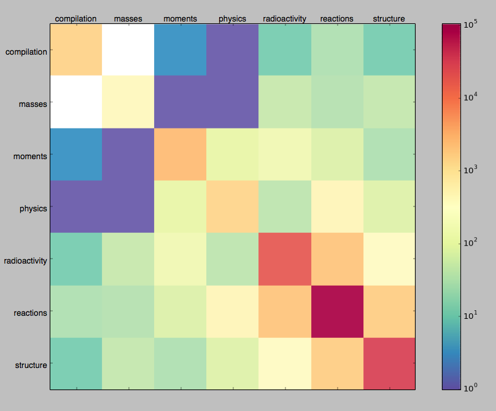

## This single large page will eventually turn into many separate pages.

# May 19-23 2014

Goals for Friday May 23rd 2014:
— Some information, an answer for preference, regarding the 1970’s peak in publication rate

— That you have dealt with your "jr" issue

— Some evidence that you have begun to consider how you will tackle text and authors

There needs to be separation from the query results and the visualizations. Currently each d3 chart is made with the returned json of an aggregate query. This is unnecessary and costly.

Mongoose has been removed from the web app. This happened in the big move to Glavin's MongoViewer. Perhaps it has a purpose again?

**"jr" issue**

Handled in vimProcessing.vs using a duplicate lookbehind as for the authors. A speedup here would be nice.

The pig.io VM should be replaced.

The returned data should be bound to an object via d3!

Did some array processing in main.js on the returned `results` array. Works for now.

**Meeting**

-Where the peaks for each doctype occur in time?

-Roby idea: Everyone published a paper the year after their thesis? How long between thesis and first paper (related to thesis), how similar is that paper to thesis? (use keywords)

-Consider possible graphs for individual papers?

-What is the best output for a search on keywords?

-Text searching 7.0 vs 7, can i control the specificity?

To solve the no zeros problem, perhaps have static Type and Year arrays in JS and then update/populate them with return data from mongo.

It is interesting that we cannot easily uniquely identify an author based on just their publication name. But perhaps we can fingerprint authors based on their publication history. Ideally we want to get biographical data from an authors publication name.

The two DocType charts have the exact same query!

# May 26-30 2014

Feasibility?

- figuring out the time gap between thesis and first paper 

- figuring out whether or not there is any clustering between the keywords or titles of theses and papers

- making a first iteration on the question of what is the best output for a search on a keyword

- visualizing the keyword search output

- and also all the while we will keep in mind that you’ve got more coding to do to improve processes (which won’t have shiny show-off-y results like the kind you produced today). 

Goals

Find query to probe thesis-jour distance per author

Enable keyword/author search with visuals

House Keeping

Separate preprocessing into data cleaning and data formatting stages.

Roby Keyword: 152Dy P.J.Twin

**Ideas**

-New collection with text searchable author list to uniquely match authors in original database when someone searches "Becquerel" match to "M.H.Becquerel"

Can we change chart axis? https://stackoverflow.com/questions/14648096/how-to-draw-logarithmic-line-charts-with-nvd3

Searching passes to a text search in an aggregation pipeline and returns json.

Separate cleaning and parsing (negates the splice operation)

Generalize the sorting function

**Monday:**

Clean the data, once and for all.

Build and populate the empty array.

Plan for clustering

# June 2-6 2014

**Goal: Solve empty array values. Cluster with R**

Instead of switching mainly on graphType, I should have a queryType. This seems more natural when we want multiple possible views for the same data.

Perhaps the initialized array should be handled as a matrix, and then I can simply add the populated matrix to the zero matrix?

Creating Twitter Word Clouds in R

    onlyAlphaNum <- function(arg1){gsub("[^[:alnum:] ]", "", arg1)}
    
    myCorpus = Corpus(VectorSource(df$text))
    
    myCorpus <- tm_map(myCorpus, onlyAlphaNum, mc.cores=1)
    
    myCorpus <- tm_map(myCorpus, tolower, mc.cores=1)
    
    myCorpus <- tm_map(myCorpus, removeNumbers, mc.cores=1)
    
    myCorpus <- tm_map(myCorpus, removePunctuation, mc.cores=1)
    
    myCorpus <- tm_map(myCorpus, removeWords, stopwords('english'), mc.cores=1)
    
    myDtm <- TermDocumentMatrix(myCorpus, control = list(minWordLength = 1))
    
    m = as.matrix(myDtm)
    
    v = sort(rowSums(m), decreasing=T)
    
    d = data.frame(word=names(v), freq=v)
    
    wordcloud(d$word, d$freq, min.freq=3)

The data to be clustered should be written to a separate collection before an R script is run. The rmongodb driver is not as up to date as other drivers.

Write notes about mclappy multi core problem.

**Next week:**

Writing up method section.

Connect rmongodb to tm in R (text mine actual database).

Meet with Pawan and discuss text mining/clustering.

**Future:**

data mining results should be connect to visualizations

query to show cliffs for keywords? All keywords with cliff of certain size?

Plot many searches against one another. Basically the relative plots. calculate vs theory vs measured

violate vs parity plots

early papers dont seem to have keyword fields. need to start using titles.

**Wrap up:**

Setup R on mac, played with textmining package and rmongodb. Did not get to use tm on rmongodb.

# June 9-13 2014

**Goal: Write some methodology. Connect R with mongodb. Meet Pawan**

**Playing with R (**http://www.r-bloggers.com/basic-overview-of-the-rmongodb-package-for-r/**)**

**`Connect to MongoDB and list dbs & collection**s`

`library(rmongodb)`

`mongo = mongo.create(host="localhost")`

`mongo.get.databases(mongo)`

`mongo.get.database.collections(mongo, db = "masters")`

**`Simple Querie**s`

`mongo.count(mongo, ns="masters.titles")`

`tmp = mongo.find.one(mongo, ns="masters.titles")`

`all = mongo.find.all(mongo, ns="masters.titles")`

`nrow(all), class(all), dim(all)`

**`Using the tm packag**e`

`library(tm)`

`myCorpus = Corpus(VectorSource(all[,3]))`

`nCorpus = tm_map(myCorpus, tolower)`

`myDtm <- TermDocumentMatrix(myCorpus, control = list(minWordLength=1))`

`findFreqTerms(myDtm, lowfreq=100)`

`findAssocs(nDtm, "distorted", 0.1)`

**Problems!**

183304 KEYWORDS abstracts in NSR Dump

`db.NSR.count({KEYWORDS: {$exists: true}})` returns 177378

How should I delimit the keywords?

KEYWORDS: "`NUCLEAR REACTIONS {+64}Ni,{+208}Pb(|a,|a),E=104 MeV; calculated |s(|q); deduced optical model potential. Diffraction model.`"

I need to revisit data representation... again.

Weird issue with regex word boundary turning match to non greedy...

`%g/^<KEYWORDS>/ s/<KEYWORDS>\([NRAC]\u\{4,} [RSMP]\u\{4,}\|[NRAC]\u\{4,}\)[ ,]\(.*\)&\n<SELECTRS>\(.*\)&$/"\L\1": {"sentence": "\2", "selector": "\3"},/`

`%g/^<KEYWORDS>/ s/<KEYWORDS>\([NRAC]\u\{4,} [RSMP]\u\{4,}\|[NRAC]\u\{4,}\)\>\(.*\)&\n<SELECTRS>\(.*\)&$/"\L\1": {"sentence": "\2", "selector": "\3"},/`

The top command works, bottom fails on the following input:

`<KEYWORDS>RADIOACTIVITY,{+107m},{+109m},{+110}Ag; measured E|g,I|g.&`

`<SELECTRS>P:107AG;A. P:109AG;A. P:110AG;A. M:G-SPECTRA;A.&`

`<KEYWORDS>NUCLEAR REACTIONS Ag(|g,|g'),{+109}Ag(n,|g); measured |s.&`

`<SELECTRS>T:AG;B. R:(G,G');B. T:109AG;C. R:(N,G);C. N:110AG;C. M:SIGMA;B. M:SIGMA;C.&`

`<KEYWORDS>RADIOACTIVITY {+107m},{+109m},{+110}Ag; measured E|g,I|g.&`

`<SELECTRS>P:107AG;A. P:109AG;A. P:110AG;A. M:G-SPECTRA;A.&`

`<KEYWORDS>NUCLEAR REACTIONS,Ag(|g,|g'),{+109}Ag(n,|g); measured |s.&`

`<SELECTRS>T:AG;B. R:(G,G');B. T:109AG;C. R:(N,G);C. N:110AG;C. M:SIGMA;B. M:SIGMA;C.&`

**Pawan**

Word bubbles/clouds of the trending keywords (use both titles and keywords) over the years.

list all the challenges

what faded away? what kept strong

Make a thesaurus.

Make a knowledge base, the input search is compared against a thesaurus, which can then translate it to a token.

`lithium11 : lithium-11, {11}Li, 11Li`

lithium11 would be a daughter node to Lithium.

And perhaps '11A' would be some type of separate node that links to lithium11, beryllium11, etc

**Goals:**

abstract

methodology notes

visualizations: wordcloud, list

thesaurus

http://stackoverflow.com/questions/15092884/how-can-i-return-an-array-of-mongodb-objects-in-pymongo-without-a-cursor-can

# June 16-20 2014

**Goal:** Abstract and Quick Clustering (maybe word clouds)

Get library books.

Thesaurus, cleaning

Quick and dirty clustering. Year, # of authors, code type, keyword type?, element(?)

The NNDC's Nuclear Science References database catalogues Nuclear Physics journals, theses, conferences and other contributions since 1896. A new data representation for the NSR has been developed with natural language searches and cluster analysis in mind. This enables an easier to use interface, more advanced queries of the data, and queries against the relationships between documents in the NSR. Using techniques from linguistics and text mining we determine popular experimental areas and methods that form trends over the decades. Data driven visualizations help illustrate the behaviour of various trends. The presentation will demonstrate the capability of the knowledge base along with the web interface. Historical insight from the physics community is desired and greatly appreciated. All technology used and created has been done so under an open source license.

Methods from linguistics research have been applied to build a text corpus for the NSR database.

Additionally, a thesaurus is constructed to enhance the usability of querying the knowledge base

specific goals in mind. USer friendly text queries,

A new JSON based data representation has been developed and is used as the schema for the document-oriented database MongoDB. //too specific?

//Mention the algorithms used in text mining.

Roby://Be general about text mining details

compare contrast what NSr offers

hook nuclear data sorting to data mining. looking in big data for patterns

technique - how. why what i am doing makes a difference compared to what already exists.

punchline - something about physics in last century they didn't know about.

phrases:

demonstrate capability

open source

attract: history buffs / cs tech folks / 

# June 23-27 2014

**Goal:** Finalize Abstract, and Quick Clustering. Start methodology.

-Sent Roby Abstract on Monday evening.

Working on 'quick clustering' wondering if I should move things to python instead? R seems great for offline analysis, but perhaps doesn't fit in my "live" workflow. I've been looking at scikit-learn, there is certainly a learning curve here.

Working on a scikit-learn notebook

"Unsupervised learning comprises tasks such as dimensionality reduction, clustering, and density estimation."

On visualizing neural networks (contains good links and visuals) http://colah.github.io/posts/2014-03-NN-Manifolds-Topology/

-Let's make a matrix of Year, doc type, keyword abstract type

Abstract v3

The NNDC's Nuclear Science References database catalogues Nuclear Physics journals, theses, conference proceedings, and other contributions since 1896. A new data representation for the NSR has been developed with natural language searches and cluster analysis in mind. This enables an interface which is easier to use, more advanced queries of the data, and queries against the relationships between documents in the NSR. Using techniques from linguistics and text mining we determine popular experimental areas and methods that form trends over the decades. Data driven visualizations help illustrate the trends. This presentation will demonstrate the capability of the knowledge base along with the interface. Further exploration of the data may be driven by insight from the audience and community. Historical insight in particular has been helpful and appreciated. All technology used and created has been done so under an open source license.

Abstract v4

The National Nuclear Data Center's Nuclear Science References (NSR) database catalogues nuclear physics journals, theses, conference proceedings, and other contributions since 1896. A new data representation for the NSR has been developed with considerations for natural language searches and cluster analysis. This enables: an interface which is easier to use; more advanced queries of the data; and queries against the relationships between documents in the NSR. Using techniques from linguistics and text mining we determine popular experimental areas and methods that form trends over the decades. Data-driven visualizations help illustrate the trends. This presentation will demonstrate the capability of the knowledge base along with the interface. Further exploration of the data may be driven by insight from the audience and community. Historical insight in particular has revealed productive directions to pursue in the data. All creation and use of technology has been under an open source license.

# July 7-11 2014

Meeting Roby at 2pm.

Sent abstract last week. Falling behind on development.

Roby Friday: Cluster. Write something.

Making of cluster1:  
`db.Bcluster.find({}).forEach(function (x) { 	switch(x["type"]){     	case 'JOUR':         	x["type"] = 1         	break;     	case 'CONF':         	x["type"] = 2         	break;     	case 'REPT':         	x["type"] = 3         	break;     	case 'BOOK':         	x["type"] = 4         	break;     	case 'PC':         	x["type"] = 5         	break;     	case 'THESIS':         	x["type"] = 6         	break;     	case 'PREPRINT':         	x["type"] = 7         	break;     	default:         	x["type"] = 8 	}  	(typeof x["reactions"] != 'undefined') ? x["reactions"]=1 : x["reactions"]=0; 	(typeof x["structure"] != 'undefined') ? x["structure"]=1 : x["structure"]=0; 	(typeof x["radioactivity"] != 'undefined') ? x["radioactivity"]=1 : x["radioactivity"]=0; 	(typeof x["physics"] != 'undefined') ? x["physics"]=1 : x["physics"]=0; 	(typeof x["moments"] != 'undefined') ? x["moments"]=1 : x["moments"]=0; 	(typeof x["compilation"] != 'undefined') ? x["compilation"]=1 : x["compilation"]=0; 	(typeof x["masses"] != 'undefined') ? x["masses"]=1 : x["masses"]=0; 	db.Bcluster1.save(x); });`

`> db.NSR3.aggregate({$match: {year: 1971}}, {$project: {year: 1, type: 1, reactions: 1, structure: 1, radioactivity: 1, physics: 1, moments: 1, compilation: 1, masses: 1}}, {$out: "cluster"} )`

Type shouldn't be a real number unless one type is actually "bigger" than the other.

Matrix visualization of the binary coincidences

# July 14-18 2014

Explain the 7 point, 3 hierarchy, plot. Learn more about what is happening to data during the reducing of dimensions

Make 7x7 height matrix (showing coincidences) 

Slides.

Going to implement the PCA reduction printout of what linear combination of variables was used. That said, I am likely to start using the PCA considerably less. It is too much of an unknown at this stage.

Making a 1896-1971 cluster with titles.

# August 18-22 2014

There has been no novel research in the past month.
A great deal of work remains to be done before DNP.

What has happened in the last month is the combination of the logging/blogging into the core website.
Specifically, metalsmith has been added to the project.
This is not entirely trivial in nature; now the entire written process will exist in one version controlled repository, mistakes, blunders, and all.

September is two weeks away, at which point my time will become increasingly sparse.
My DNP presentation is less than two months away.
The submitted abstracts is as follows:

>The National Nuclear Data Center's Nuclear Science References (NSR) database
>catalogues nuclear physics journals, theses, conference proceedings, and other
>contributions since 1896. A new data representation for the NSR has been
>developed with considerations for natural language searches and cluster
>analysis. This enables: an interface which is easier to use; more advanced
>queries of the data; and queries against the relationships between documents in
>the NSR. Using techniques from linguistics and text mining we determine popular
>experimental areas and methods that form trends over the decades. Data-driven
>visualizations help illustrate the trends. This presentation will demonstrate
>the capability of the knowledge base along with the interface. Further
>exploration of the data may be driven by insight from the audience and
>community. Historical insight in particular has revealed productive directions
>to pursue in the data. All creation and use of technology has been under an
>open source license.

Ideas taken from June 16-20 week: 

- Be general about text mining details.
- Compare contrast what NSR offers.
- Related nuclear data sorting to data mining. Looking in big data for patterns
- Cover the technique
- Demonstrate capability
- Why what I am doing makes a difference compared to what already exists.
- Punchline: Something about physics in last century they didn't know about.
